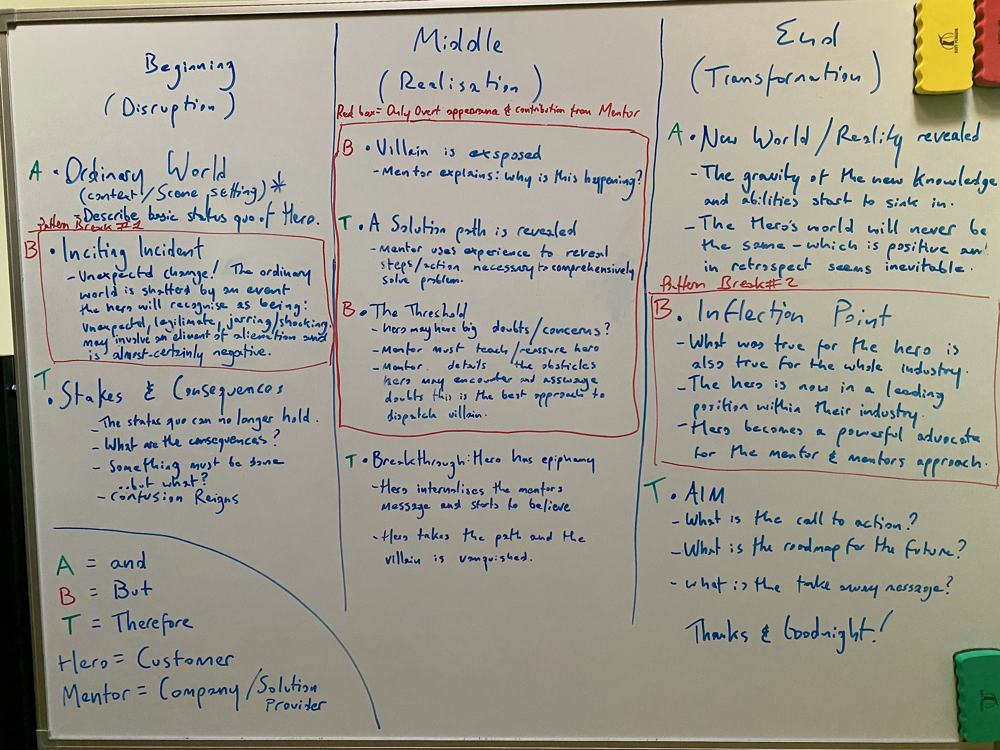

# The Science of Making Ideas Land

*A psychology-grounded approach to presentation and communication*

> "What's the difference between a vision and a hallucination? It becomes a vision when others can see it."

---

## The Storytelling Framework

Three essays. Same machinery. Different sides of the fence.

| | |
|---|---|
| 😇 **[The Storytelling Framework](00-storytelling-framework.md)** | The craft - how to make ideas land using narrative structure, audience psychology, and the hero's journey. The gamekeeper. |
| 👿 **[The Story Doesn't Care If It's True](01-the-story-doesnt-care.md)** | The warning - the same framework powers propaganda, and the machine was never fitted with a truth gauge. The poacher. |
| 🕵🏻‍♂️ **[Where Are The Receipts?](02-where-are-the-receipts.md)** | The equipment - a compact mental toolkit for distinguishing evidence from the shape of evidence. The auditor. |

---

## Miscellaneous Essays

*Thoughts, tangents, things that interest me but I'm Not sure where they belong?*

| Post | Topic |
|------|-------|
| [The Cuckoo's Egg](posts/cuckoos-egg.md) | Belief, provenance, and the supernormal stimulus — how to check what's in your nest |

---

## The Archive

### 📚 Psychology Deep Dives

These pieces explore the cognitive science behind effective communication:

| Post | Topic |
|------|-------|
| [Transportation](posts/01-transportation.md) | How stories literally transport us neurologically |
| [The Peak-End Rule](posts/02-peak-end-rule.md) | Why endings and emotional peaks matter most |
| [Why Stories Matter](posts/17-why-stories-matter.md) | Narrative as the brain's default sense-making device |
| [It's About Time](posts/16-its-about-time.md) | Time perception and the neuroscience of stress |
| [Primacy Theory](posts/15-primacy-theory.md) | The psychology of first impressions |
| [The Spotlight Effect](posts/22-spotlight-effect.md) | Managing the illusion that everyone is watching |
| [The Neurochemistry of Presenting](posts/21-neurochemistry-of-presenting.md) | Dopamine, serotonin, cortisol, and testosterone |
| [Cerebral Seeds](posts/06-cerebral-seeds.md) | Memory consolidation and idea uptake |
| [Language and Memory](posts/11-language-and-memory.md) | Linguistic techniques that stick |
| [The Default Mode](posts/12-default-mode.md) | The brain's wandering mind and how to engage it |

### 🧠 Communication Psychology

Material exploring the psychology of human connection:

| Post | Topic |
|------|-------|
| [First Impressions](posts/24-first-impressions.md) | The Dame Edna quadrant — what we reveal instantly |
| [Thinking and Feeling](posts/25-thinking-and-feeling.md) | Facts vs emotion in persuasion |
| [Mirror Neurons](posts/26-mirror-neurons.md) | The neuroscience of empathy and connection |
| [Mirror Neurons — Part 2](posts/27-mirror-neurons-part-2.md) | Bidirectional influence |
| [Non-Verbal Communication](posts/28-non-verbal-communication.md) | Beyond the Mehrabian myth |
| [The Duchenne Smile](posts/29-duchenne-smile.md) | Authentic smiles and oxytocin |
| [Eye Contact](posts/30-eye-contact.md) | Saccadic vision and the window to the soul |

### 🎭 Vocal Mastery

A complete vocal training module:

| Post | Topic |
|------|-------|
| [It's Not What You Say...](posts/32-vocal-delivery.md) | The power of tonality |
| [Vocal Variety — Pitch](posts/33-vocal-pitch.md) | The seesaw of highs and lows 🎢 |
| [Vocal Variety — Pace](posts/34-vocal-pace.md) | The BBC 150 wpm standard 🎼 |
| [Vocal Variety — Intonation](posts/35-vocal-intonation.md) | How emphasis changes meaning 🎯 |
| [Active Voice and Tense](posts/36-active-voice.md) | Present tense, active voice 🎭 |
| [Treading the Boards](posts/31-treading-the-boards.md) | Method acting for presenters |
| [PREP Framework](posts/37-prep-framework.md) | Impromptu speaking — tack like a sailboat ⛵ |

### 🎯 Presentation Craft

Practical techniques for structuring and delivering presentations:

| Post | Topic |
|------|-------|
| [Controlling Nerves — Part 1](posts/18-controlling-nerves-part-1.md) | Pre-presentation anxiety management |
| [Controlling Nerves — Part 2](posts/19-controlling-nerves-part-2.md) | Real-time nerve control (box breathing, power poses) |
| [Creating an Introduction](posts/20-creating-an-introduction.md) | The four-stage opening framework (WIIFT) |
| [Positive Visualisation](posts/23-positive-visualisation.md) | Mental rehearsal techniques from sports psychology |
| [Perfecting Imperfection](posts/03-perfecting-imperfection.md) | Authenticity over polish |
| [May I Have Your Attention](posts/10-may-i-have-your-attention.md) | Attention capture and retention |
| [Beyond Bullet Points](posts/07-beyond-bullet-points.md) | Visual communication that works |
| [Writing Backwards](posts/09-writing-backwards.md) | Start with the ending |
| [The Alphabet of Story](posts/08-alphabet-of-story.md) | Story structure fundamentals |
| [Audience Profiling](posts/13-audience-profiling.md) | Understanding who you're speaking to |
| [Congruence](posts/14-congruence.md) | Aligning words, tone, and body language |

---

## About

These materials were developed through decades of real-world presentation experience — from panicked first presentations to TV & Radio interviews, corporate keynotes to training courses.

The approach is grounded in **communication psychology**, not showmanship. The goal isn't to perform — it's to make ideas land.

**Mark Sunner** — Former CTO of MessageLabs (acquired by Symantec), speaker, and avid student of the science of communication.

---

*37 posts migrated from Digital Ape Training (2019-2024) and collaborative training materials.*
