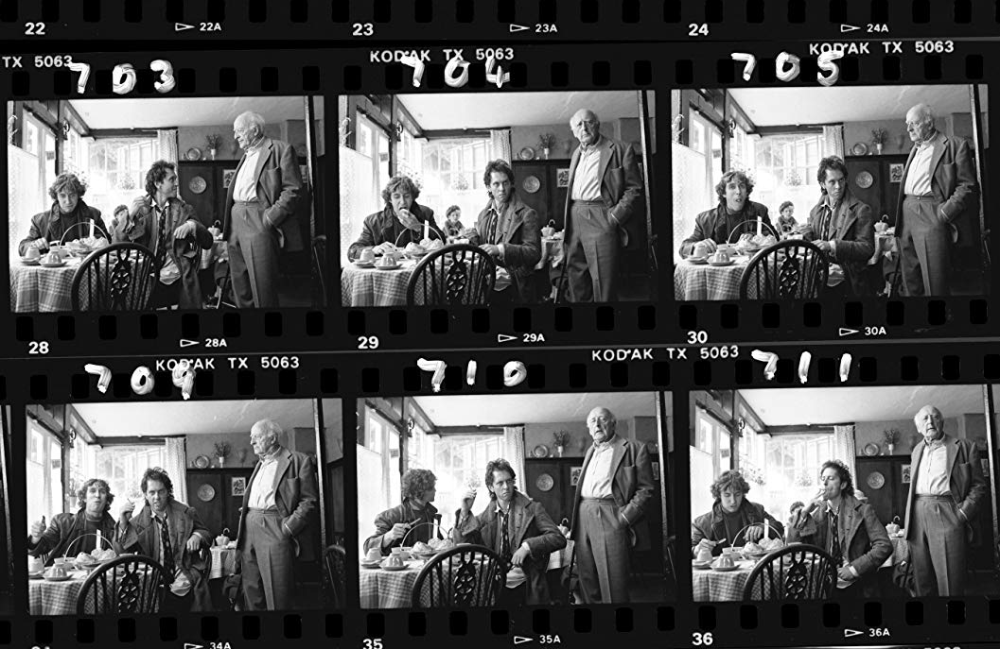

# My First Blog — I'm Going to Make Mistakes

*By Mark Sunner — Digital Ape Training*
*November 1, 2019*

---

What is your favorite film? This is an almost impossible question to answer, but one film that is never far from my top spot is the 1987 cult classic, **'Withnail and I'** ..often abbreviated to just 'Withnail' amongst devotees.

Written and directed by Bruce Robbinson, the story is a semi-autobiographic tale of two unemployed thespians in distress. To this day it remains the only film I never tire of watching, and is an absolute treasure trove of quotable gems for fans to bat back and forth, much to the annoyance of some ;-)

---

## Bruce Robbinson's First Day

This movie was also Bruce Robbinson's directorial debut, and legend has it that he did something quite unusual on the first day, before the cameras started rolling. Bruce assembled the whole cast and crew, stood on a chair, and announced:

> **"I'm going to make mistakes - I don't know what I'm doing!"**

He did not make any attempt to hide his novice credentials, but instead sought to make a virtue of them. He knew that between them the cast and crew collectively had enough experience to rival the most seasoned of directors, and he needed to tap this brain trust and learn from *them* if his script was going to get the performance it deserved.

---

## Applying This to Blogging

I found myself thinking about Bruce's moment of sincerity as I stared at the word processing screen filled with my first blog attempt. Something was wrong. I had not written a blog before - and yet, here I was trying to write one with the air of an old pro. The resulting cognitive dissonance of this charade meant I did not recognise the voice behind my own words?

When presenting I have found it is vital to be yourself. The further you stray from your own magnetic north the more your audience will sense it, and the end result invariably smacks of insincerity. Even if your intentions are genuine and well-meaning, your message will be robbed of its emotional gravity if it does not come from the heart.

And so, I have decided to take what I know to be true for presenting and apply it to blogging.

To quote Bruce Robbinson, **I'm going to make mistakes - I don't know what I'm doing!** Far better that I jump in and fess up, risk making mistakes but learn from them as they happen. Rather than churn out something so endlessly sanitised for a corporate audience it ends up not really meaning anything.

But this is a journey, one that I hope you, dear reader will join me on.

Also to quote Bruce Robbinson, *We've just run out of wine. What are we going to do about it?*

---

## Reader Comments

> *"A big fan of Withnail and I. I'll go for another cult classic. John Carpenter's The Thing. Sci-Fi, Horror, Thriller and Drama all rolled into one. Welcome to blogging world Mark, looking forward to hearing more about Digital Ape. 'Get in the back of the van!'"*
