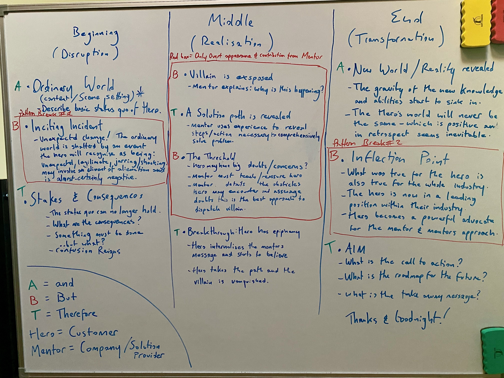

# The Psychology of Compelling Presentations

*Leveraging Cognitive Patterns for Positive Impact*

*By Mark Sunner — Digital Ape Training*

---

The human mind is remarkably adept at processing and retaining information that aligns with certain cognitive patterns. While these patterns can sometimes lead us astray — as demonstrated in the case of conspiracy theories — they can also be ethically leveraged to create more engaging and memorable presentations. This essay explores how understanding three key cognitive biases can enhance our presentation skills and improve audience engagement.

## Pattern Recognition: Creating Coherent Narratives

Our minds are naturally wired to seek and recognize patterns — it's a survival mechanism that helped our ancestors identify everything from predator tracks to safe food sources. In presentations, we can ethically leverage this tendency by:

- **Creating clear, logical structures** that allow audiences to anticipate and follow the flow of information. Unlike conspiracy theories that force patterns where none exist, effective presentations should reveal genuine, meaningful connections.

- **Using recurring themes or motifs** throughout the presentation that reinforce key messages. This creates a sense of coherence that makes content more memorable and digestible.

- **Employing the "rule of three"** in content organization, as human minds are particularly receptive to patterns of three. This could mean organizing content into three main points, using three supporting examples, or structuring the presentation with three distinct sections.

## Agency Detection: Building Audience Connection

Our predisposition to detect agency — to assume purposeful intervention — can be channeled positively in presentations through:

- **Incorporating relevant personal stories** and experiences that demonstrate human agency in solving problems or achieving goals. This satisfies the audience's natural inclination to seek human causation while providing valuable context.

- **Using active voice and clear attribution** when discussing actions and outcomes, rather than passive constructions that obscure agency. This creates clarity and maintains audience engagement.

- **Encouraging audience participation** through thoughtful questions and interactive elements, allowing them to exercise their own agency in the learning process.

## Proportionality Bias: Managing Impact and Expectations

The human tendency to assume that significant outcomes must have equally significant causes can be addressed constructively by:

- **Acknowledging both major and minor factors** that contribute to outcomes, helping audiences understand complex causality without oversimplification.

- **Breaking down large concepts or challenges** into manageable components, showing how smaller actions can accumulate to create significant impact.

- **Using appropriate scaling** in examples and analogies to help audiences grasp relationships between causes and effects accurately.

## Practical Implementation Strategies

### Structure and Flow
- Begin with a compelling hook that establishes pattern recognition early
- Create clear transitions that build logical connections between sections
- Use consistent visual and verbal cues to reinforce key themes

### Engagement Techniques
- Incorporate storytelling elements that demonstrate clear cause-and-effect relationships
- Use inclusive language that acknowledges audience agency
- Create opportunities for audience interaction and feedback

### Visual Support
- Develop clean, consistent visual designs that support pattern recognition
- Use visual hierarchies to demonstrate relationships between concepts
- Employ graphics that accurately represent proportional relationships

## Ethical Considerations

Unlike conspiracy theories that exploit cognitive biases to mislead, effective presentations should:

- Present accurate information with appropriate context
- Acknowledge complexity while maintaining clarity
- Empower audiences through understanding rather than manipulation
- Encourage critical thinking and questioning

---

## Conclusion

By understanding and ethically leveraging these cognitive patterns, presenters can create more engaging, memorable, and impactful presentations. The key is to work with these natural tendencies of the human mind while maintaining commitment to accuracy, clarity, and audience empowerment.

The most effective presentations don't force patterns where none exist or oversimplify complex relationships. Instead, they help audiences discover genuine connections, understand true agency, and grasp authentic proportional relationships in the subject matter. This approach not only makes presentations more compelling but also contributes to better understanding and retention of the material.
