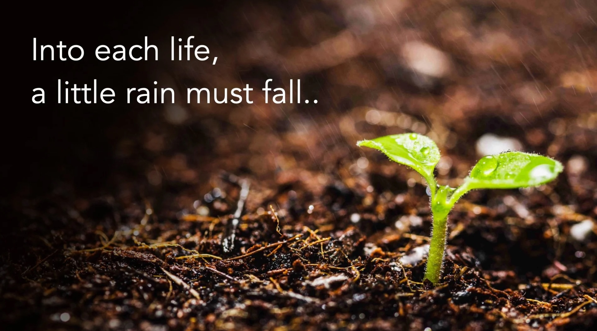

# Cerebral Seeds

*By Mark Sunner — Digital Ape Training*
*September 13, 2023*

---

> **What's the difference between a vision and a hallucination?**
> 
> *...it's a vision when other people can see it.*

Have you ever had a brilliant idea but struggled to get others to buy into it? Panic not, this is a common experience, and help is at hand because this is where the power of context comes hurtling to the rescue.

By providing a clear and well-described context for your message, you can effectively lay the foundation for a successful "seed planting" of your idea in the minds of others. This means identifying the points of hardship, conflict, or aggravation surrounding your topic, and speaking to your audience in the language of shared experience.

Think about it this way: what constitutes a "bad day" for people dealing with the issue you're addressing? What are the consequences of these obstacles? By highlighting these points, you can show your audience that you understand their struggles and have a solution that will make a real difference.

But the importance of context doesn't stop there. A strong setup can also greatly amplify the impact of any premise. By building a foundation of shared understanding and experience, you create a much more receptive audience for your message. This is especially true when it comes to planting a seed in someone's mind, as it allows you to speak to their specific needs and concerns in a way that resonates with them.

So, what's the end result of all this? A well-planted seed has the potential to germinate and take root, leading to the audience doing, thinking, or feeling something. This might involve taking action to address the problem, changing their perspective on an issue, or simply feeling more informed and empowered to make a difference.

---

In conclusion, the importance of context in communication cannot be underestimated. By taking the time to carefully consider the context of your message, you increase the chances of it being heard and acted upon, and ultimately make a greater difference in the world. 

So go ahead and plant those seeds — just be sure to provide the best cerebral fertile ground for them to germinate.
