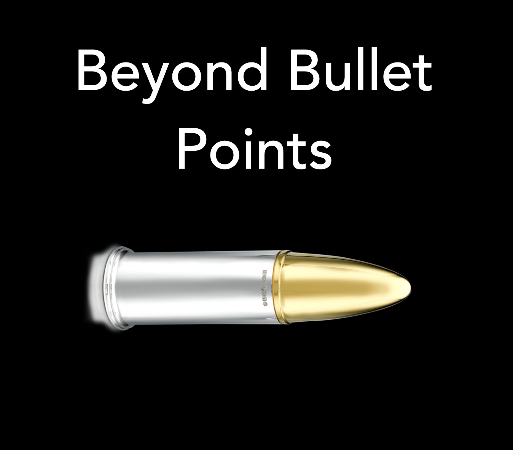
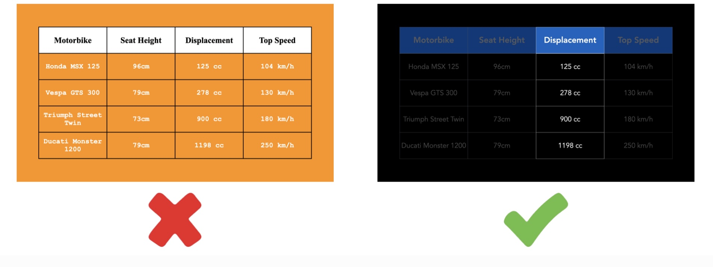

# Beyond Bullet Points: Designing Slides with the Brain in Mind

*By Mark Sunner — Digital Ape Training*
*November 23, 2023*

---

Death by PowerPoint — we've all experienced it — that feeling of zoning out during a punishing slide presentation. Whilst a good slide deck can enhance your explanations, a bad one can introduce unnecessary confusion and/or distraction, severely dampening the impact of your message.

Like a bullet fired from a gun, an effective slide deck isn't accidental—it's designed. Consider what actually makes a bullet fly, you might assume, "gunpowder". But that's only partially true, it's just the beginning. Once in the air, the bullet must grapple with dual frictions: air resistance and gravity. Its shape and weight have been meticulously engineered to cut through the air and maintain an unwavering trajectory. Similarly, an effective slide deck must overcome the friction of audience comprehension and wavering attention if the speaker's message is going to land and be remembered in a meaningful way.

This blog post is not about whether to use slides or not—that depends on context, audience, and personal style. Instead, I want to focus on the scenarios where slides are already the chosen tool, and how we can craft them to best hit their intended target. We'll explore principles from a user experience (UX) design perspective, with a view to overcoming cognitive friction. In essence, we're not just creating slides; we're using UX techniques to engineer persuasion.

---

## Frictionless UX Tactics for Slide Design

### 1. One Message per Slide

The dirty secret is that our cognitive bandwidth is deceptively narrow and easily overloaded. However, the majority of slide decks never take this fallibility into consideration — unfortunately, they exacerbate it by introducing multiple messages, concepts or tangents on a single slide. Not only does this trigger overload, it also creates an instant mismatch with the speaker's real-time delivery.

When this happens our comprehension quickly falters and we disengage from the information being presented, redirecting the experience to the black hole of short-term memory. Whilst short term memory is great for remembering the location of the cup handle you are about to pick up, it only lasts for a fleeting 90 seconds before being cast into oblivion. Can't remember what you were *pretending* to nod about only moments ago? That's short-term memory in action — and busy slides are a recipe for triggering exactly this type of amnesia.

Instead of overwhelming your audience with a jumble of ideas on a single slide, consider a more user-friendly approach: **one message per slide**. This approach respects cognitive limitations, allowing real-time comprehension and aligns naturally with the speaker's pace and delivery. By prioritising comprehension and actively eliminating disengagement, the flow of information will be far more memorable.

But what if you have multiple messages? No problem. First, decide if you really need a slide at all — it might be that verbal descriptions are perfectly adequate. But, if you do require a visual then simply dedicate a separate slide to each distinct message. If this balloons your slide count, don't worry. Remember, the issue is NOT the number of slides, but rather, the amount of information per slide. A presentation with thirty well-designed, focused slides, will be far more effective—and memorable—than ten slides, each crammed with multiple messages.

*Cluttered bullets vs focused messaging*

### 2. Number of Elements

Strive for simplicity in your design. Depth and detail are the job of the speaker — YOU are the presentation, not the slide deck. Eliminate all unnecessary elements or frills that do not contribute to your main message. Use negative space effectively to give your content room to breathe so your slides do not look or feel crowded. 

Remember the instructive rule coined by cognitive psychologist George Miller: The average person can only hold about 7 objects in their working memory. If a slide has more than seven elements, it's likely overwhelming your audience.

*Cluttered complexity vs focused simplicity*

### 3. Guiding Attention

In slide design, contrast serves a function similar to depth of field in photography—it dictates where your audience's attention should be directed. Just as a photographer uses depth of field to make the subject of the image crisp and clear while the background remains blurry, you can use contrast in your slides to emphasise the important points while leaving the context subtly present, yet not overpowering.

A photograph without depth of field is less engaging because if every detail is equally focused the subject becomes ambiguous. Similarly, a complex slide without contrast fails to guide the audience, consequently their attention may easily scatter. Don't leave it to chance. By employing contrast strategically, you create a "depth of field" for your slides: when important elements are highlighted their significance becomes instantly digestible. Supporting details remain present but unobtrusive. This careful use of contrast guides the audience's attention exactly where you want it, making the content more compelling and memorable.

*Contrast directs the eye to what matters*

### 4. Size vs Eye Tracking

Have you ever navigated your way around an unfamiliar airport? Essential signs like 'exit' or 'gates' are usually the largest, catching your attention instantly. In slide design, the same principle applies—size matters.

In essence, size equals importance. The largest object on your slide should be the key point you want your audience to notice first. Lesser points, still crucial but not as much as the primary one, should be smaller. This technique takes advantage of the viewer's inherent attention pattern—our eyes are naturally drawn to larger, more dominant objects.

Think of it as designing a journey for the viewer's eyes, starting with the largest element, then sequentially guiding their gaze down to smaller ones. This guides your audience through your narrative in an orderly fashion, enhancing comprehension and engagement. By harnessing our instinctive response to size, your slide will naturally become more visually arresting and meaningful.

*Size creates hierarchy — guide the eye to what matters most*

### 5. The Cocktail Party Effect

Consider this situation: You're at a social gathering, engrossed in conversation with a stranger. Suddenly, you hear your name mentioned from across the room. Your attention splits — even though you're nodding and maintaining eye contact with the person you're speaking to, your mind has wandered off to the other conversation—what are they saying about you? Is it positive or negative? In that moment, you've become a living testament to the fact that humans cannot genuinely multitask — in psychology, this is known as "The Cocktail Party Effect".

In a presentation, overwhelming your audience with hefty paragraphs on a slide while simultaneously delivering a verbal narrative can lead to exactly this kind of cognitive strain. It's akin to asking your audience to be part of two conversations at the same time—both demanding attention. In trying to keep up with both, your audience ends up missing the essence of each.

To prevent this cognitive duel from happening, ensure that your slides complement your speech, rather than compete with it. Minimise on-screen text, limiting it to short phrases or bullet points that serve as signposts guiding your audience through your presentation. Avoid long sentences or paragraphs that compel your audience to read while you are speaking. If a sentence is crucial to your slide, make sure it's succinct, punchy, and directly tied to your spoken narrative.

*Complement your speech, don't compete with it*

---

## Conclusion

Slides are your faithful wingman, they exist to enhance your delivery, but without stealing your thunder. An effective slide deck should enhance the fidelity of the story you are already telling, using visual cues to signpost key points and underscore messages to help keep the audience engaged.

Just as the effectiveness of a bullet is determined by its ability to overcome multiple frictions — the power of a slide deck isn't determined by the quantity of slides, or even the aesthetic appeal—it's gauged by their ability to navigate the cognitive frictions of your audience and complement the spoken message you deliver. Armed with an understanding of how the human brain processes information, we can all become much better architects of visual persuasion, crafting presentations that hit the mark with consistency.

So, the next time you fire up PowerPoint or Keynote, take a moment to ask yourself: are you simply cutting and pasting a Franken-deck of unrefined corporate soundbites, or are you enhancing the cognitive journey being verbally sculpted by the speaker? The answer will make a substantial difference to the overall persuasiveness and memorability of your message.
