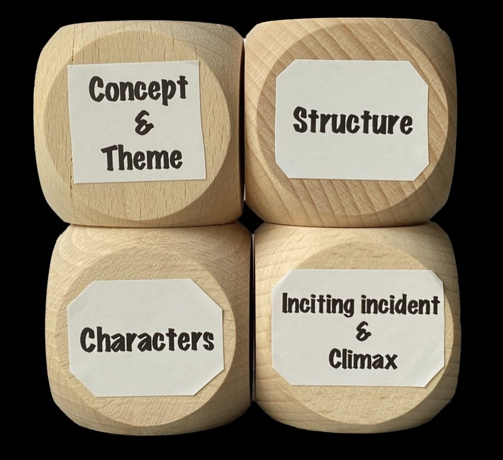

# The Alphabet of Story & MessageLabs

*By Mark Sunner — Digital Ape Training*
*November 17, 2023*

---

In 1999 I had a problem that very nearly drove me mad.

I was working at MessageLabs, a fledgling internet security startup, back before "cloud" was a verb or anyone had coined the acronym "SaaS". We filtered viruses and malicious content out of email traffic before it ever reached the customer. I knew, with absolute certainty, that this was going to save people from genuine harm. Not save them money. Save them harm. And so I would walk into meeting after meeting and say, in effect: there is a bad thing out there, it is coming, here is the lifeboat, get on board now.

Reader: They rarely got on board.

To them, I was a vendor with an agenda. A warning from a vendor is a sales pitch, and every professional buyer on Earth wears armour against sales pitches. The more earnestly I pointed at the iceberg, the more desperate I sounded. I was almost certainly repelling the very people I was trying to protect.

And here is the part that still stings. In almost every case, I knew I would hear from that person again. Months later the phone would ring, and the conversation was always, word for word, the same:

"Hang on. So if I'd been using your thing... this wouldn't have happened?"

They had to learn the hard way what I had been trying to tell them the whole time. I could not solve this conundrum, and for a long while I didn't even understand it. Only years later did I find the words for what was actually going on: I was asking people to read the label from inside the jar. And nobody can do that.

The metaphor that took years

I'd love to tell you I had an epiphany. I didn't. What I had was frustration, and enough repetitions of the same failed pitch to start noticing which fragments of it made eyes glaze over and which made heads tilt.

The fragment that eventually survived came from thinking about utilities. People in 1999 could already conceptualise internet access as being a bit like power: a single pipe into the building that everything plugs into. But power turned out to be the wrong utility for describing viruses. There's nothing lurking in electricity.

Water, though. Water genuinely does carry bacteria and contaminants, and yet none of us boils it before drinking, because it's cleaned upstream, at the source, by people whose job that is. Nobody expects the individual householder to purify their own supply. So why on earth were we expecting every individual company to scrub its own email?

That was the version that finally hit home. Not because the facts had changed. Same product, same threat, same me. What changed was the vehicle. The metaphor didn't ask anyone to agree with a vendor. It asked them to imagine something familiar, and while they were busy imagining, the new idea slipped quietly past the armour. It was a way of letting people glimpse, just for a moment, that they might be inside a jar, and that there might be something written on the label they couldn't see.

The alphabet

Years later, Ed Sheeran stood in a courtroom accused of plagiarism and defended himself by invoking a "musical alphabet": the small set of fundamental elements from which every pop song is built. Same letters, infinite songs. Watching him dismantle the case with that one idea, I realised storytelling has an alphabet too, and that without knowing its name, it was exactly what we had been using at MessageLabs.

Here are its letters, as I understand them.

Concept and theme. The concept is your unique angle; the theme is the message everything orbits. Ours was secure internet usage made as unremarkable as clean water from a tap. Once we had that, it acted as a compass for every decision that followed.

Structure: hook, build, pay-off. A hook that piques interest (the raw internet is toxic, and your current defences are a saucepan on the stove), a build that deepens it (what if it were cleaned at the source?), and a pay-off that resolves it (here is what that looks like, and here is your life with the problem simply gone).

Hero and villain. Your hero needn't be a person. Ours was an idea: protection in the cloud, upstream, before harm arrives. And the villain was never a competitor. It was the invisible, evolving toxicity of unfiltered internet traffic, an enemy the audience couldn't see precisely because they were inside the jar with it.

Inciting incident and climax. The inciting incident is the moment the problem becomes undeniable; the climax is the confrontation where the hero meets the villain and prevails. For our audiences, sadly, the inciting incident was too often that phone call after the breach. The whole point of telling the story well was to let them experience that moment in imagination instead of in real life.

Just as letters combine into every word ever written, these few elements underpin every narrative, whatever its form. Once we knew our answers to each of them, we could generate an endless supply of presentations, speeches and marketing collateral from the same source, and that narrative backbone ran through the entire company like Brighton through a stick of rock.

What I actually learned

I'll be honest: I never did find a way to make someone read the label from inside their jar. I don't believe there is one. Direct argument, however true, however urgent, tends to bounce off the armour we all wear.

But a story is a jar someone can look into from the outside. Hand people the right one and they'll see the label for themselves, and, better still, they'll believe they spotted it on their own. That, more than any framework or formula, is the real power of the storytelling alphabet. It's not a trick for winning arguments. It's a way of giving people a vantage point they cannot otherwise reach.

It only took me twenty-odd years to work that out - better late than never?! 🐌
