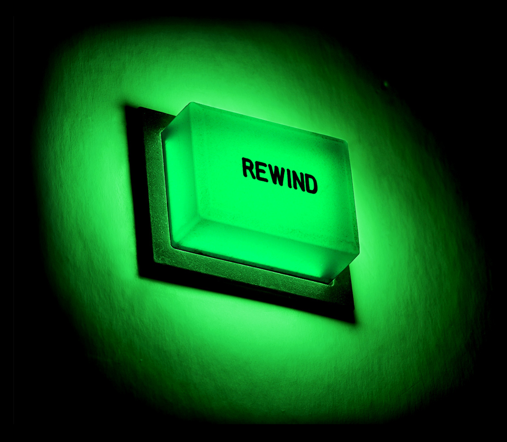

# Enrich Dry Topics by Writing Backwards

*By Mark Sunner — Digital Ape Training*
*December 1, 2022*

---

Have you ever found yourself trying to communicate a complex or dry subject, but struggling to turn it into a compelling story? It can be challenging to engage your audience and effectively communicate your message when the subject matter is technical or difficult to understand.

But don't worry — one solution is to assemble a "Technical story" by **writing backwards**.

So, what exactly is a Technical story? It's a narrative that structures the information you have as a detective might assemble their evidence and engages the reader with both observations and their impact. It's not just about presenting information, but about crafting a story that connects with your audience and helps them understand the significance of what you're presenting.

---

## The Four Steps to Construct a Technical Story

### 1. Determine the Punchline

The first thing you need to do is consider what the final take-away message(s) should be. This message will dictate the structure of your entire story and lead to an overall summary. This is the punchline of your story.

### 2. Provide Supporting Evidence

Once you have determined your take-home message(s), move backwards and formally bolster them with supporting hard evidence. This could be in the form of projections of discernible benefits, such as cost savings or improvement benchmarks. Be sure to only include data or information that specifically supports your take-home message(s).

### 3. Explain What Made It Possible

After you have provided supporting evidence, move one step further backwards and explain what made it possible. This could be an accidental discovery, a new innovation or a streamlined approach that you have implemented — what factors lead to its genesis? 

Again, it is important to be disciplined and discard anything that does not lead towards the take-home message. This is the engine room of your talk, and the most likely place to create the "Emotional Resonance" necessary to open minds via their natural curiosity.

### 4. Invert Your Work!

Having written backwards to correctly focus your efforts, simply invert your work and voilà, you now have a compelling three-stage narrative:

- **Beginning:** Explanation of the possible
- **Middle:** Supporting evidence
- **End:** The punchline / take-away message

To complete your story, now craft a powerful introduction. This involves starting with an imaginative and/or unexpected statement to initially capture the attention of your audience.

---

By following these steps, you can effectively use the technique of "writing backwards" in the same way that comedians often construct their funniest skits — start with the punchline, then build up to it, ensuring that your story has a clear beginning, middle, and end. 

This approach will help you focus on the most important aspects, whilst avoiding unnecessary or distracting tangents. So next time you're struggling to turn a dry technical subject into a story, try "writing backwards" to create a compelling narrative that connects with your audience, and lands your message with precision.
