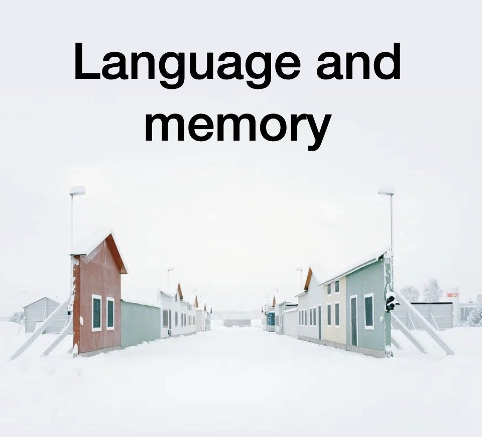

# Language and Memory: The Unseen Power of Words

*By Mark Sunner — Digital Ape Training*
*October 27, 2023*

---

Picture the scene: a crisp autumn morning in 18th century Russia. Grigory Potemkin, a shrewd advisor (and secret on/off lover) to Empress Catherine the Great, faces a problem. He needs to convince the notoriously fickle Empress that his newly acquired territory is bountiful when the truth is quite the opposite! So, what does he do? He gets creative (read: deceptive) by ordering his army to build elaborate facades of prosperous villages, hastily erected along the riverbanks as Catherine passes by on her royal barge. And just like that, the legend of the "Potemkin village" is born.

Now, you might be wondering: "What does this have to do with memory and language?" Well, it turns out that our memories aren't exactly the reliable, high-fidelity recordings we often think they are. In fact, they are much more like deceptive Potemkin villages themselves—instantaneously constructed, reconstructed, and easily influenced by the way we frame our experiences.

---

## Elizabeth Loftus and the Malleability of Memory

Take the groundbreaking work of psychologist Elizabeth Loftus, for example. Her studies have shown that our memories are not only entirely reconstructed at the moment of recall but also subject to significant inaccuracies and embellishments based on how the initial experience was framed. Elements that we'd lay money we're recalling with certainty may, in fact, be entirely fabricated courtesy of some backstage cerebral-Photoshop, entirely hidden from our conscious scrutiny.

In one of her most famous experiments, Loftus demonstrated the power of language in shaping our memories. Participants were shown a video of a car accident and then asked how fast the cars were going when they "hit" each other. Later, other participants were asked the same question, but this time the verb was changed to "smashed." 

The simple change of a single word influenced the participants' perceptions of the accident's severity, with those who heard "smashed" vividly recalling higher speeds and even more damage. Loftus' research demonstrated that by simply altering the language used when asking witnesses to recall an event, she could manipulate their memories — adding details or changing key facts.

---

## The Real-World Implications

And here's the kicker: this malleability of memory isn't just some psychological curiosity—it has real-world implications, particularly when it comes to communication. If you're giving a speech or presentation, for instance, the way you frame your message matters. You see, choosing your words with care and precision can make a huge difference in how your audience remembers what you've said.

Whether you're an experienced speaker or just trying to get your point across in a meeting, it's worth taking the time to craft your message thoughtfully. By doing so, you're not just making a good impression in the moment, but you're also ensuring that your message will be remembered effectively and accurately long after your talk has finished.

In the end, our memories, like Potemkin's villages, may not be perfect replicas of reality, but they can be influenced and guided by the way we present our stories. As communicators, we have an obligation to recognise this malleability and use it to our advantage. By crafting our narratives with care and attention, we can make our messages more memorable, more persuasive, and ultimately, more impactful.

---

So, the next time you find yourself preparing for a big talk, remember the story of Grigory Potemkin and his clever illusion. Just as he constructed those fake villages to frame a lasting impression for Catherine the Great, you too can carefully construct your language to ensure your message is not only heard but also remembered for all the right reasons. And by doing so, you'll be harnessing the power of language to shape memories, leaving your audience with a strong, lasting impression that remains true to your intention.
