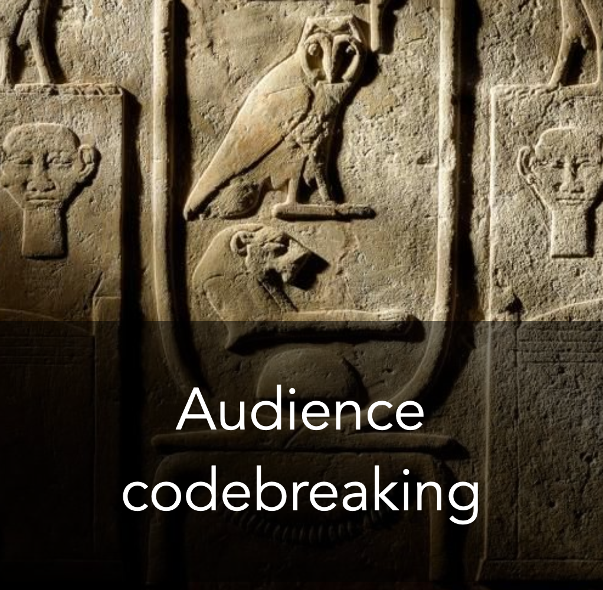

# Why Audience Profiling is the Rosetta Stone of Crafting a Speech That Resonates

*By Mark Sunner — Digital Ape Training*
*November 1, 2023*

---

Have you ever sat through a speech or presentation that left you feeling uninterested, unengaged, or even frustrated? Perhaps the speaker seemed to be talking at you, rather than to you, or the topic simply didn't seem relevant or interesting to your life?

The Rosetta Stone was an ancient Egyptian artefact that became the key to unlocking the mysteries of ancient Egypt. It was a stone tablet with the same text written in three different scripts, including ancient Egyptian hieroglyphs, which up until that point had been unreadable — the stone allowed enough key data points to be deciphered in order to crack the rest of the code.

Just like the Rosetta Stone was the key to unlocking the secrets of ancient Egypt, **Audience Profiling** is the key to unlocking the crucial data points that will allow your message to connect and not leave relevance to chance.

---

## The Common Trap

The truth is, many speakers fall into the trap of assuming that just because they find something interesting, their audience will too. But this is a big mistake. If you don't know anything about your audience, you won't be able to identify and tell the right "type" of story that your audience actually wants to hear. And when your message misses the mark, it's not only boring, it's ineffective.

So if you want to deliver a speech that truly resonates and makes an impact, don't fall into the trap of assuming your audience will automatically be interested. Instead, do a little detective work to truly understand them first.

---

## Six Tips to Profile Your Audience

1. **Consider their problems and challenges.** What are they struggling with, and how can your speech or presentation help them overcome those challenges?

2. **Consider their hopes, values, and ambitions** that might make them view your idea in a positive light.

3. **Identify their fears and anxieties** that may put them off your idea, and address them directly in your speech or presentation.

4. **Consider any potential preconceptions** they might have about your idea(s), and work to dispel any misconceptions they might have.

5. **Connect with your audience by telling a relatable story** about someone else like them — who is this person and what's their backstory?

6. **Incorporate social proof** by finding the best person or group to offer credibility and trust that your idea is valuable or effective.

---

By incorporating some or all of the above into your profiling process, you'll be able to decipher the "Rosetta Stone" of your audience's profile and create a powerful message that truly speaks to their hearts and minds.

Remember, audience profiling is not a one-time event — it's an ongoing process that requires continual refinement and adjustment. Never trust your gut instinct alone, because the odds that your hot-buttons consistently match those of the audience are not in your favour. Instead, leave nothing to chance and correctly profile your audience, *before* putting pen to paper, this will dramatically shift the odds in your favour of being able to craft a message that not only resonates but will be far more effective and memorable as a result.
