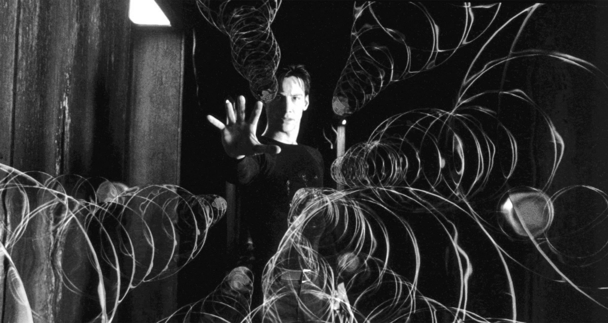

# It's About Time

*By Mark Sunner — Digital Ape Training*
*November 2, 2019*

---

July 1989, and I'm at the cliff edge of a panic attack as I walk briskly to the large and intimidating classroom 2. I work in the technical support dept of a computer training company - but I'm about to get my big break. 12 students are waiting for their networking course to start - but, unbeknownst to them, their instructor just left in an ambulance. There's no replacement on site and yours truly has been drafted. I'm escorted to the front of the room by the managing director who explains the situation - a replacement is on the way - all I have to do is get things started until he/she arrives. Just one problem. I have never spoken in public before. At 19, I am painfully shy, introverted, and get tense just standing in a checkout queue - this is my worst nightmare made manifest.

Recalling a traumatic event from a safe distance of 30+ years, the amount of detail I can recollect is surprising. But, there's a catch - and it's a doozy. The same cognitive forces responsible for recording these high fidelity memories are going to trip me up, and in so doing, very nearly cause a full-blown meltdown. Specifically, my ability to perceive time correctly is about to become seriously, un-glued.

24 eyes are on me and I am physically shaking. I look at the foil on the overhead projector (a device from a pre-powerpoint-agean era). Novell NetWare 2.x. OK, I know this - it's actually my favorite thing. I wake up thinking about networks. I go to sleep thinking about networks. I don't get out much.

I start talking. But there is a problem - as I turn each acetate on the OHP, it's taking me too long to orient my thoughts. The time it's taking me to 'think' feels absolutely cavernous. I worry about how this must be coming across to the students. To my mind, it feels like I am suddenly operating at a glacial speed, and small universes must be forming in the time it is taking me to construct each sentence or explanation. I try to compensate in the only way I can - by talking faster, and faster, and faster still. But the more I try to compensate - the worse it gets. It quite literally feels like a car crash unfolding in slow motion. The whole situation is spiraling out of control and I contemplate running from the room, the building, and my job. What I don't realise is that everything is fine, it's actually my perception of time that has been completely blown off its axis.

---

## The Neuroscience of Time Perception

To explain what's happing we need to look at how memories are made. In a critical situation, an area of the brain called the amygdala kicks into high gear and commandeers resources from the rest of the brain, causing everything to attend to the situation at hand. When the amygdala is activated memories are laid down with far more detail than under normal circumstances. It's a bit like the higher frame-rate your phone uses to make a 'Slo-Mo' video. These memories are richer and more vivid. So that if you are ever in a similar situation, you have more information at your disposal to work out how to stay alive.

BUT, there is a fascinating consequence. When such events are replayed in your memory, they appear to have taken much l-o-n-g-e-r in time. The time distortion is actually something that happens in retrospect - a trick of the memory, that changes our perception of reality.

---

## The Aftermath

Back in the classroom, we get to the 11 o'clock coffee break and the substitute instructor has arrived. I distinctly remember feeling weird and mentally exhausted. Only two hours had elapsed but it quite literally felt like days.

I return to my desk, convinced that I have royally screwed things up. But later that same day something crazy happens. It turns out the networking students had rather enjoyed my "weird descriptions"? Just one thing - "We'd like him to come back - but could he just slow it down a bit?". I'm asked to join the replacement instructor, and together we finish teaching the three-day course as a co-teach. A month later I am offered the opportunity to become a full-time instructor and the trajectory of my life was forever changed.

---

## What I Would Tell My Younger Self

It would be several decades before I properly understood how elasticated our perception of time could become. If I had a time machine, 50 year old me would journey back and visit my 19 year old self. After buying some Apple stock, and perhaps warning two young Winklevoss twins to watch-out for someone called Zuckerburg - I would tell myself NOT to panic. That my perception of time in that moment was not real - not even close. That, I should have taken a few slow breaths and tried to relax.

I do not have a time machine. I cannot change *my* past. But, if you recognise yourself in the above description then it is my sincere hope that I can help your future. If you are new to presenting, and your mind is racing - take a few slow breaths. Try to relax. Take your time, it's fine. S l o w d o w n. Your audience, cannot take in what you are saying, until you stop saying it - pauses - as it turns out, are good.

Interested to find our more? We do hope so - because this is just the tip of a fascinating cognitive iceberg.

---

## Postscript: A Comment from Mike Cheeseman

*The director mentioned in this story commented on the original post:*

> Well I am the director mentioned in this blog, and I remember this as clearly as Mark does decades later! I am still grateful to Mark for being willing to 'give it a go'. I had the benefit of being confident that Mark would be fine - his subject knowledge was excellent, he was passionate about the technology, and a natural communicator. I guessed he would get the timing all wrong (but on a three-day course that would easily be put right). I think we also explained the situation and told our students that Mark wasn't a lecturer - they would have worked that out for themselves quickly enough so much better to be honest up front!
>
> Anyway, Mark did a great job that day and went on to become an outstanding presenter. Quite a few years later I was delighted to hear Mark being interviewed on Radio 4 as a technical specialist in some aspect of internet security - a very polished performance Mark. I felt quite proud knowing that my company had helped develop Mark's innate talent.
>
> If any potential Digital Ape customers are reading this comment - I am 100% confident that you will be in good hands.
