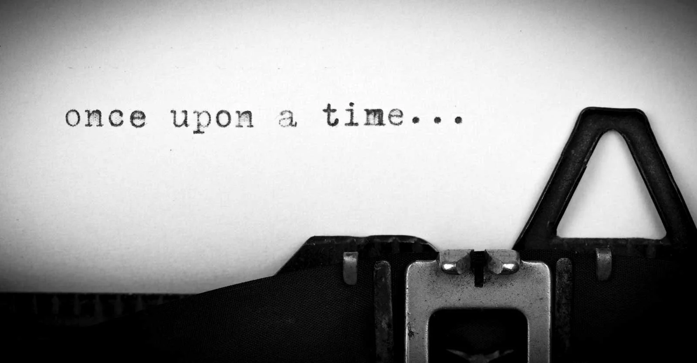

# Why Stories Matter

*By Mark Sunner — Digital Ape Training*
*November 4, 2019*

---

What is your favourite story? I'm going to go with The Count of Monte Cristo - the book, rather than the film - which was a bit disappointing. I think it is safe to say that we all love a good story, whether it's a novel, film or even just a charismatic raconteur in the pub. For evidence, just look at the collective sense of bereavement when broadcast epics such as Breaking Bad or Game of Thrones came to an end, to see how addicted we can all become.

But ***why*** do we love stories so much, and why do they have the power to captivate and transport us? I think I can answer this, but bear with me, because it's going to get a little weird!

Take a look at this classic psychology experiment - the Heider and Simmel animation from 1944:

📺 [Watch: Heider and Simmel Original](https://www.youtube.com/watch?v=kSOdGEPWVBQ)

---

## After Watching...

**What are your thoughts on the following:**

1. What kind of a person is the big triangle?
2. What kind of a person is the circle?
3. Why did the two triangles fight?

I suspect that you will have absolutely no problem thinking of creative answers to these questions, and plenty more besides.

That is quite striking - after all, it's just basic shapes randomly moving around. And yet, I would lay money the descriptions in your mind were full of rich detail, and even started to form the basis of a plot or narrative complete with emotions. Why is that? **The answer is that narrative is the default device by which our conscious mind tries to make sense of the world.**

---

## The Greatest Storyteller

As you go about your daily life the little voice in your head, your inner monologue, rides shotgun with you, making little comments and interpretations as it tries to rationalise the bombardment of sensory data all around into the coherent stream of thought, better known as consciousness. And at the centre of this thrilling neural show lies you, the hero, vanquishing villains, assembling allies, as you make your way through the living drama that is the story arc of your life. Your consciousness, making sense of the melee, is perhaps the greatest storyteller of all time - and it has a recognisable shape: **Crisis, Struggle, Resolution.** This is why we love stories so much - because they match how ***we*** think.

---

## Finding the Story

During my career in IT I have witnessed well over a thousand presentations up close. Some were good, some were bad, a few howlers stank like a warm brie - all of them were mine.

It took me an embarrassingly long time to figure out why some presentations connected better than others - and I will get into some of the other things I have discovered during subsequent blog posts. But if I had to pick just one thing, something simple that makes a huge difference - it would be: **find a way to tell stories.**

That might sound a little counterintuitive if the topic is business metrics, product strategy or a technical roadmap - where there can be a strong temptation to stick strictly to the facts and figures. The problem with a pure fact-based delivery is it does not match how we really think - and this means it is far less likely to sink in or leave a lasting impression.

Stories motivate us to learn. Stories turn fact into plot. Stories aid understanding and makes the complex digestible. The human brain is quite literally hard wired to love stories, and a good one can trigger a dopamine hit similar to a bite of your favourite choc bar.

So the next time you need to give a presentation or talk where the subject matter is a little dry - ask yourself how did it get there? What is the cause and effect? Who stands to lose? Who stands to gain? Where is the drama?

**Find the story behind what you want to present**, just like you started to see one forming in the animation. Stories unlock the alchemy of getting your message across - because like a key unlocking a padlock with a satisfying 'click', you will have matched the way people actually think.

---

## Reader Comments

> *"Great mark. Haven't seen one of your presentations for years but always remember them. The story is the answer!"*
> — Simon Jackson
