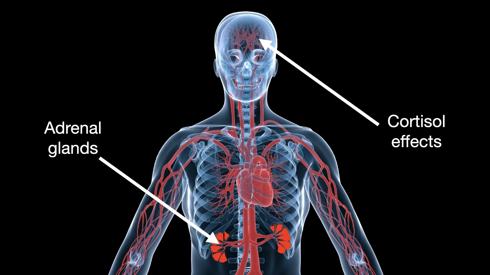

# Controlling Nerves — Part 2

*By Mark Sunner — Digital Ape Training*
*December 2, 2019*

---

In part one of this blog post, we discussed what can be done to help calm nerves prior to delivering a speech or presentation. In this follow-up post, I will propose what can be done to help calm nerves **whilst you are actually speaking in real-time**.

To re-cap, the root cause behind anxiety when speaking to an audience is that the fight or flight response will have been triggered, causing large amounts of cortisol and adrenaline to be swilling around the body.

These hormones are produced by the adrenal glands and play a role in the body's stress response. Unhelpful symptoms include a racing heart, sweaty palms, etc.. but by far the most unhelpful symptom is **impaired memory, difficulty concentrating and making decisions**. This is because cortisol alters the way that neurons communicate with each other in the brain. It can also interfere with the functioning of the prefrontal cortex, which is responsible for higher cognitive functions.

The upshot of all this is that your thinking may become slow and foggy at the precise moment you need to be at your sharpest.

---

## The Good News

The good news is that these symptoms will fade quickly. Usually within 1-3 minutes in someone of average build and body mass. Provided you stay calm your clarity of thought will magically return as the initial spike of adrenaline and cortisol naturally dissipates within the body.

However, some situations may arise that can cause a prolonged spike, or even a secondary surge of these unhelpful chemicals. Examples of something that might throw a fledgling presenter off-balance might be an equipment failure, mind going blank for what feels like a prolonged period of time, losing your voice, or even an accidental altercation with the audience.

Whilst it is never as bad as you think - any one of these scenarios will trigger a stress response, which entails (you guessed it) the adrenal glands dumping even larger quantities of adrenaline and cortisol into the body. This further compounds whatever problem you're attempting to deal with – more commonly referred to as a **'panic cycle'** - but alas, not the type you could ride away on - however, much you might want to!

So, in the unlikely event something like this has happened, what can we do about it? Fortunately help is at hand - there are steps we can take to surreptitiously short-circuit a panic cycle and regain our composure without the audience noticing.

---

## Three Ways to Calm Nerves While Speaking

**1. Use physical gesticulation** to dissipate cortisol and engage the audience. This activates the relaxation response in the body, reducing stress and making the speaker feel more confident and in control.

**2. Practice breathing control** to regulate the stress response. Take slow, deep breaths and sync them with your words, exhaling fully to release tension. Use specific techniques like **box breathing**, which involves inhaling for four seconds, holding for four seconds, exhaling for four seconds, and holding again for four seconds, which can trigger an instant and powerful calming effect.

**3. Rely on rehearsals** to provide familiarity and confidence in handling unexpected events. Rehearsing a speech helps deliver it smoothly and confidently, setting the stage for a successful presentation.

---

## Summary

It is normal to experience anxiety and stress when speaking due to the release of cortisol and adrenaline. These hormones can impair memory and cognitive function, but these symptoms will usually fade within a few minutes if you stay calm. However, unexpected events such as equipment failure can trigger a panic cycle and further release of stress hormones, compounding the problem. To calm nerves in real-time while speaking, use physical gesticulation, practice breathing control, and fall back on rehearsed knowledge to regain composure and deliver a successful presentation.
