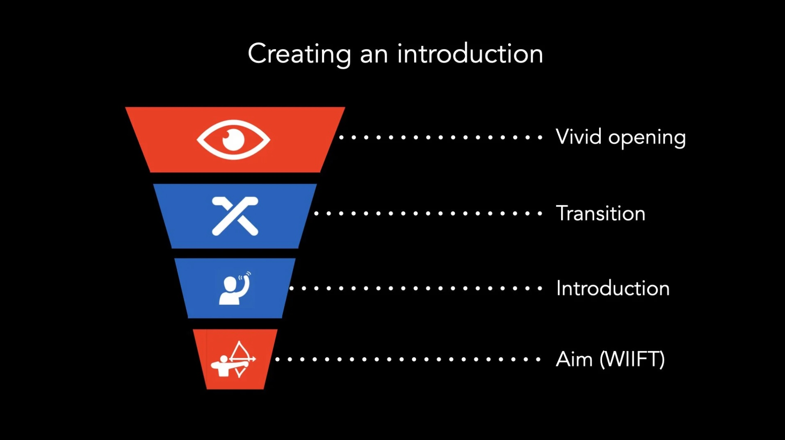

# Creating an Introduction

*By Mark Sunner — Digital Ape Training*
*February 1, 2020*

---

Whilst every talk or presentation will be unique and have its own distinct flavour, there is a simple four-stage process you can follow to create a simple introduction that will easily create maximum engagement. This process involves starting with a vivid opening to grab the audience's attention, transitioning into the topic at hand, introducing yourself, and clearly stating the aim or purpose of your talk. By following this process, you set the stage for an engaging presentation to follow, whilst effectively 'capturing' the audience.

---

## The Four Key Stages

### 1. Start with a vivid opening to grab people's attention

The first few minutes of your presentation are crucial for setting the stage and engaging your audience. The audience will expect your presentation to start like every other one they have ever seen – it's vital to go against the grain and hit them with something unexpected. One effective way to do this is to start with a personal story, or a surprising fact or perhaps a relevant/thought-provoking/edgy quotation. This helps to immediately draw the audience in and create a connection with them. It's important to choose an opening that is relevant to your topic and resonates with your audience. Be as vivid and emotive as possible whilst remaining true to your own character - *don't put on an act*.

**Just be YOU ..plus a bit.**

### 2. Transition from the dream world state of the vivid opening back to the room / task at hand

After you've grabbed the audience's attention with your imaginative opening, you need to smoothly connect this to the topic of your talk. Take care to ensure your transition does not sound clunky or ham-fisted - rehearsing is by far the best way iron out any kinks. This helps to ground the audience and acknowledge that the presentation is about to begin. A bit like a "teaser trailer", your transition will hopefully create a sense of expectation and excitement for what is about to come.

### 3. Introduce yourself - but, be brief

After you've transitioned to the topic of your talk, it's important to introduce yourself to the audience. This can be as simple as stating your name and job title, but try not to get too caught up in banging on about your background and/or expertise. Remember, the audience primarily want to hear about the **content** of your talk – you are there as a facilitator/storyteller - take care that *YOU* do not accidentally eclipse the actual subject matter.

### 4. Clearly state the Aim or Purpose of your talk (**WIIFT** — What's In It For Them)

It is important to clearly communicate the purpose of your presentation to your audience. What specifically do you want the audience to do as a result of listening to you? Are you trying to persuade them to adopt a new perspective, take a certain action, or simply learn something new? By clearly stating your purpose, you help to focus the audience's attention and give them a clear takeaway / call-to-action from your presentation.

---

By following these four steps, you can begin your presentation with confidence and engage your audience from the start.

Good luck - you *will* be great!
