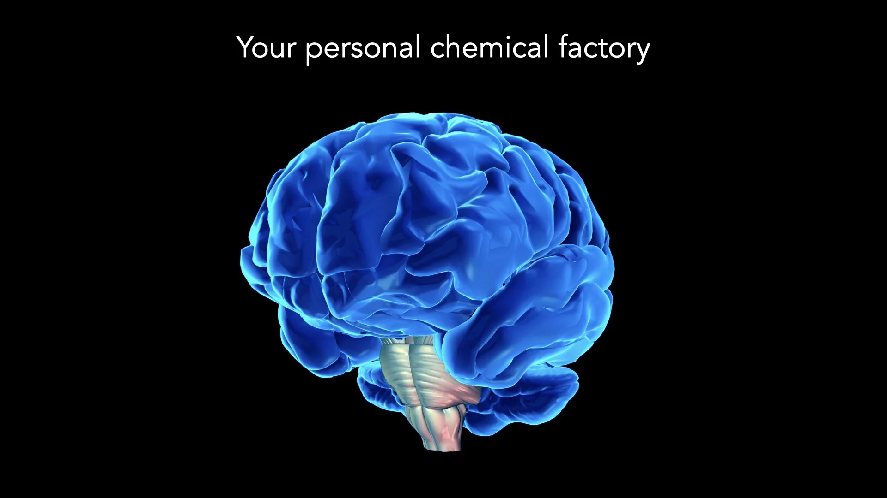

# The Neurochemistry of Presenting

*By Mark Sunner — Digital Ape Training*
*March 1, 2020*

---

In this blog post we will explore the neuroscience of presenting and the impact that various brain chemicals have on both speakers and audience members alike. Specifically, we will examine the role of neurotransmitters such as dopamine, serotonin, and cortisol, as well as hormones like testosterone, and how they influence our feelings, thoughts, and behaviours. Understanding these chemicals can help us manage the pressure of presenting and improve the level of engagement we gain from the audience.

---

## Dopamine

As a neurotransmitter, dopamine is involved in the brain's reward / pleasure systems and is released in the brain when we experience something nice, leading to feelings of happiness and satisfaction. As a public speaker, you can increase dopamine levels in your audience through positive reinforcement, emotive storytelling, and humor. These techniques can increase motivation, engagement, and create a more positive and enjoyable experience for listeners.

## Serotonin

Serotonin is a neurotransmitter that plays a key role in mood regulation. It is often referred to as the "feel-good" neurotransmitter because it can help to improve mood and reduce feelings of anxiety and stress. When speaking to a large audience, a speaker can promote the release of serotonin by incorporating techniques that elicit positive attention and feedback. For example, a speaker could encourage audience participation and interaction, such as by asking questions or inviting feedback, as this can help to increase feelings of connection and involvement. Additionally, the speaker could use humour and positive language to create a more uplifting and enjoyable experience for the audience. These techniques can help to boost serotonin levels in the minds of audience members, leading to improved mood and a sense of well-being. This can be particularly useful for speakers addressing sensitive or difficult topics, as it can help to mitigate negative emotions and promote a sense of positivity and hope.

## Cortisol

It is often referred to as the "stress hormone" because it can have a number of negative effects on the body when it is present at high levels for extended periods of time. During public speaking, cortisol may be released in response to the stress and anxiety that the speaker may be feeling. This can lead to negative physical and mental effects, including increased heart rate, elevated blood pressure, and difficulty concentrating - however, as we have already discussed in our blog on Controlling Nerves (Parts 1 & 2), these effects can be easily mitigated.

## Testosterone

Often referred to as the dominance hormone, natural testosterone levels can be increased through the use of a **"power pose"** before and during a presentation. A power pose is a body posture that boosts confidence and assertiveness. Examples include standing with feet shoulder-width apart and using wide gesticulation to take up an above average amount of available space. These poses have been shown to increase testosterone levels, confidence and assertiveness. Using power poses during a presentation, through open and expansive gestures and confident posture, can also boost the speaker's confidence and be perceived as more dominant by the audience.

---

## Conclusion

Dopamine, serotonin, cortisol, and testosterone are all chemical signalling molecules that can have a significant impact on the brain and behaviour when someone is speaking to a large audience. While some of these substances, such as dopamine and serotonin, may have positive effects on mood and motivation, others, such as cortisol and testosterone, may lead to negative physical and mental effects if present for extended periods of time. Understanding the role that these substances play in the brain can help us to better understand and manage the experience of presenting.
