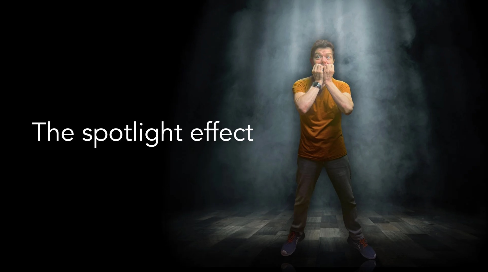

# The Spotlight Effect

*By Mark Sunner — Digital Ape Training*
*April 2, 2020*

---

Have you ever found yourself feeling nervous and self-conscious in a social situation, as if everyone is staring at you and judging your every move? If so, you may have experienced the spotlight effect.

This unhelpful cognitive bias is a psychological phenomenon that occurs when people believe they are receiving more attention and scrutiny than they actually are. This can lead to feelings of anxiety and self-consciousness, especially in social situations or when giving a speech or presentation.

---

## The Illusion of Transparency

There is some research suggesting that the spotlight effect may be related to the human tendency to overestimate the degree to which our internal experiences and behaviours are visible to others. This tendency is known as the **"illusion of transparency"** and may have evolved as a way to help humans better understand the perspectives and intentions of others.

It's important to note that the spotlight effect is not a universal phenomenon and is likely influenced by individual differences and cultural factors. It's also not clear that the spotlight effect serves a specific adaptive function or has any direct evolutionary purpose.

---

## Why It Matters for Presenters

The spotlight effect can be problematic when presenting as, left unchecked, unnecessary anxiety and self-consciousness can undermine your performance. This is because the belief that everyone is paying close attention to your every move can lead to a preoccupation with how you are being perceived, rather than focusing on the content. This can result in a lack of fluidity in delivery, and may lead to overcompensation and a desire to impress, which will be less authentic and genuine.

---

## Managing the Spotlight Effect

**1. Pay attention to your thoughts and challenge negative self-talk.** It's easy to get caught up in negative thoughts when you feel like you're in the spotlight. Try to recognise when you're having these thoughts and challenge them by reminding yourself that you're probably not as important or noticed as you think.

**2. Focus on the present moment.** The spotlight effect can cause you to get lost in your own head, but by focusing on the present moment, you can stay grounded and better handle any anxiety or self-consciousness you may be feeling.

**3. Rehearse, rehearse, rehearse!** Thoroughly preparing and practicing your speech beforehand can significantly reduce the negative effects of the spotlight effect. By rehearsing your delivery, you can increase your confidence and focus on delivering the content rather than worrying about how you are being perceived. This can help to reduce anxiety and self-consciousness and improve your performance. Don't skimp on the rehearsals - the more you practice, the better equipped you'll be to handle any unexpected curveballs and deliver a successful presentation.

---

## A Thought to Hold Onto

> *"You'll become way less concerned with what other people think of you, when you realise how seldom they do."*
> — David Foster Wallace

There is a surprising amount of truth and wisdom contained in that quip.

By following the tips above, you can reduce the influence of the spotlight effect and become a more confident and effective public speaker. Remember, it's normal to feel a little nervous in social situations, but by being mindful of your thoughts, focusing on the present moment, and practicing self-acceptance and self-compassion, you can manage those feelings and feel far more at ease.
