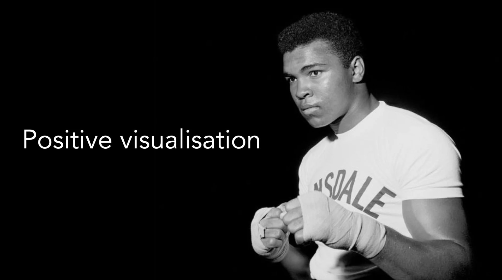

# Positive Visualisation

*By Mark Sunner — Digital Ape Training*
*May 1, 2020*

---

Positive visualisation, or the practice of mentally rehearsing and visualising desired outcomes in advance, has played a significant role in the field of sport psychology. Muhammad Ali, one of the greatest boxers of all time, was an early adopter of this strategy, using it to optimise his performance and disrupt his opponents' mental game.

Today, positive visualisation is widely recognised as a key component of elite sport psychology and is used by athletes at all levels, from amateur to professional. In addition to being used as a performance enhancement tool, visualisation is also used to help athletes overcome obstacles and setbacks, such as injuries or losses.

The proven results of positive visualisation in sport psychology can also be applied to the field of public speaking. Public speakers can use visualisation to mentally rehearse and visualise their desired outcomes for their presentations, increasing their confidence and focus and helping them to deliver a successful performance.

---

## Three Tips for Positive Visualisation

**1. Set a clear, specific goal:** Before visualising, it is important to have a clear and specific goal in mind. This could be nailing a specific aspect of the presentation, such as the opening or closing, or delivering the entire presentation with confidence and poise. By setting a clear goal, it will be easier to visualise the desired outcome and focus on achieving it.

**2. Create a detailed mental image:** Once you have set your goal, try to create a detailed mental image of what it will look and feel like to achieve it. Imagine yourself standing confidently in front of the audience, speaking with clarity and poise. Try to include as many sensory details as possible, such as the sights, sounds, and feelings associated with the successful presentation.

**3. Practice regularly:** Visualisation is most effective when it is practiced regularly. Try to set aside a few minutes each day to visualise your desired outcome, and try to make the mental image as vivid and real as possible. The more you practice, the more familiar and confident you will become with the visualisation process.

---

Overall, the field of positive visualisation has come a long way since Muhammad Ali's pioneering use of this strategy. Today, it is an integral part of modern day, elite sport psychology, helping athletes at all levels to optimise their performance, overcome obstacles, and achieve their desired outcomes. It can also be a powerful tool for public speakers, helping them to prepare and deliver successful presentations.
