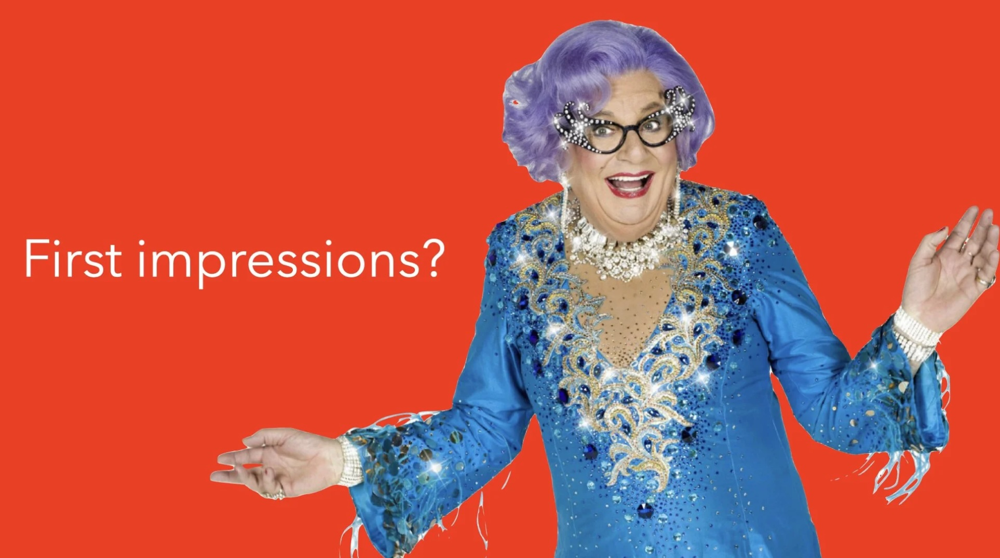
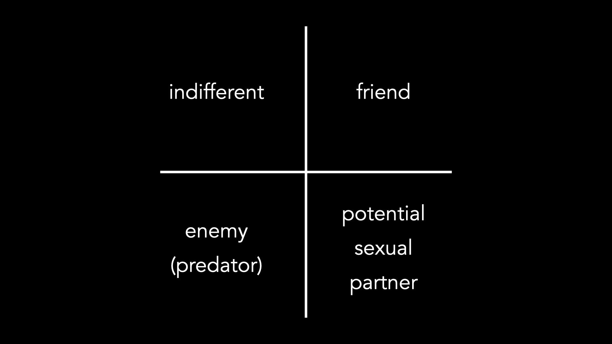

# First Impressions

*By Mark Sunner — Digital Ape Training*

---

> **You're yet to speak — but has the audience already made up their mind?**

When it comes to public speaking, first impressions can be especially important. As speakers, we are often trying to persuade or influence our audience in some way. If we make a poor first impression, it can be difficult to regain the trust and attention of our audience. On the other hand, making a strong first impression can help to establish credibility and set the stage for a successful presentation.

So, what happens in those first few crucial seconds when the audience lays eyes on us? Our limbic brain, which is responsible for our emotions and instincts, becomes active and begins to classify the encounter. Instantaneously, the audience will be making snap judgements and trying to decide whether they think we will be good or bad for them.

*The limbic brain's instant classification: indifferent, friend, enemy, or potential mate*

During this unconscious thought process, their ancient mammalian cognitive-machinery will quickly switch from a classification of 'indifference' to that of potential friend, enemy (predator), or even, a potential mate — yikes! To be clear, this is not suggesting anything untoward is taking place, this unconscious human reaction takes place during every first encounter, thanks to millennia of hardwired evolutionary programming.

Once the limbic brain has made this initial assessment, it begins to selectively choose information that confirms this assessment and ignores anything that might contradict it. This means that our initial impression can be very difficult to change. So, as speakers, it is vital to make a good first impression and land in the friend category.

## So, How Can We Do This?

There are a few things we can do to improve our chances of making a positive first impression.

**First**, we should ensure that we are well-groomed and presentable. But we should also dress appropriately — should you wear a suit/smart dress if everyone else will be ultra casual? You need to figure this out ahead of time — but aiming to be just 'one notch' smarter dressed than the event demands is a great rule-of-thumb. This might seem like an obvious point, but it's worth underlining because this crucial box must be ticked *before* we can hope to project a sense of energy and competence.

**Second**, we must SMILE and be friendly. This shows that we are approachable and willing to engage with our audience.

**Third**, we can try to be positive and upbeat. This can help to create a pleasant and welcoming atmosphere.

In addition to these things, it can be helpful to be mindful of our body language. Standing up straight and maintaining eye contact can convey confidence and openness. On the other hand, slouching or avoiding eye contact can give the impression that we are uninterested or even untrustworthy.

---

## Conclusion

Overall, it is clear that first impressions really matter, and this counts doubly-so when it comes to speaking or presenting. By being well-groomed, friendly, positive, and mindful of our body language, we can increase our chances of making a strong and positive impression on our audience. This can help us to establish credibility and be more effective in our speaking engagements and in life.
