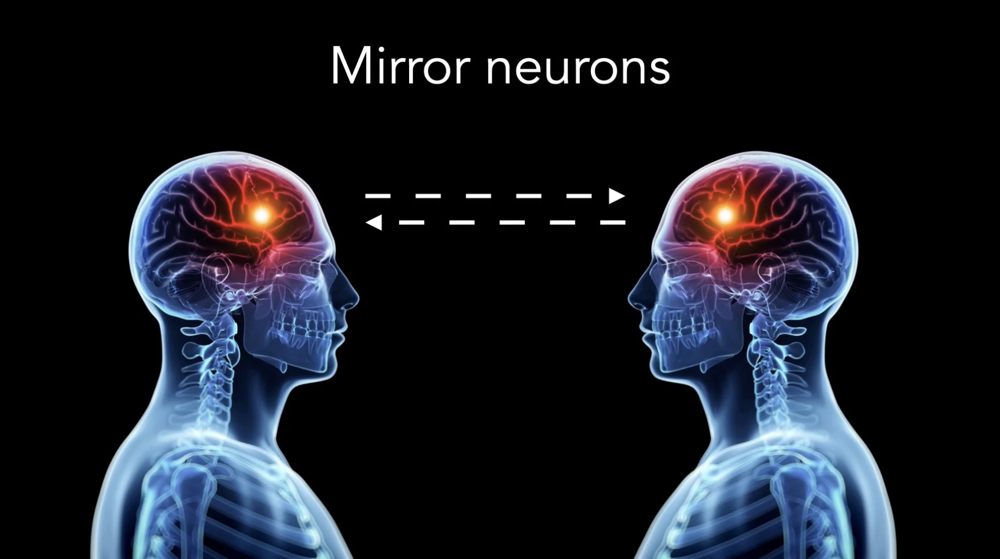

# Mirror Neurons — Part 1

*By Mark Sunner — Digital Ape Training*

---

Mirror neurons were first discovered by accident in the 1990s, when neurophysiologists were studying the brain activity of macaque monkeys as they performed various tasks. The scientists observed that certain neurons in the monkeys' brains became active not only when the monkeys performed certain actions, but also when they observed another monkey or human performing the same action.

These neurons, which were later named mirror neurons, were initially thought to play a role in the monkeys' ability to imitate the actions of others. However, further research has shown that mirror neurons are involved in a wide range of behaviors, including understanding and empathizing with others, learning through imitation, and even experiencing emotions.

To give a working example, when viewers watch television programs such as *'I'm a Celebrity... Get Me Out of Here'* and see the contestants eating bugs or being covered in spiders, their mirror neurons may be activated, causing them to experience a similar emotional response as the contestants on the show. This can lead to the viewer feeling discomfort or even disgust, causing them to wince or look away from the screen. This is because the brain is able to "mirror" the emotions and actions of others, allowing us to understand and relate to their experiences on a deeper level.

Today, mirror neurons are considered to be an important discovery in the field of neuroscience, and their study has led to a greater understanding of how the brain processes social interactions and the role that empathy plays in our relationships with others. In the realm of presentation skills, understanding mirror neurons can be especially valuable for speakers looking to engage and persuade their audience.

---

## Five Ways to Use Mirror Neurons in Your Presentations

**1. Use body language to your advantage**

Mirror neurons are activated not just by observing actions, but also by observing body language. By using confident, expressive body language, a speaker can help to engage the mirror neurons of their audience and improve the impact of their message.

**2. Empathise with your audience**

By attempting to understand the perspective of your audience and showing that you care about their needs and concerns, you can help to activate their mirror neurons and improve the connection between you and your audience.

**3. Use storytelling to engage your audience**

Stories are a powerful tool for activating mirror neurons and engaging an audience. By using stories to illustrate your points, you can help your audience to better understand and relate to your message.

**4. Use rhetorical devices to persuade your audience**

Rhetorical devices such as repetition, rhetorical questions, and emotional appeals can all be effective in activating mirror neurons and persuading an audience.

**5. Practice, practice, practice**

The more you practice your presentation, the more comfortable you will become with the material, and the more likely you are to engage your audience's mirror neurons.

---

## Summary

Understanding the role of mirror neurons in communication can help speakers to increase the impact of their presentations by using body language, empathy, storytelling, rhetorical devices, and practice to engage and persuade their audience. By incorporating these strategies into their presentations, speakers can help to create a deeper connection with their audience and effectively communicate their message.
