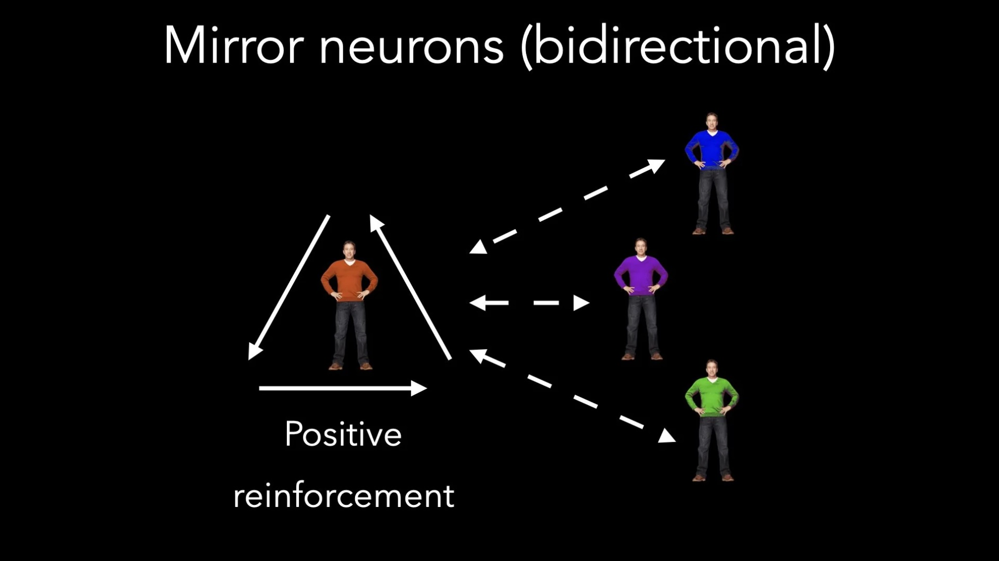

# Mirror Neurons — Part 2

*By Mark Sunner — Digital Ape Training*

---

In my previous blog post, I wrote about Mirror Neurons. Specifically, what we know about them and how we can use this technical awareness to better connect and communicate with any audience.

However, there is one scenario where mirror neurons have an inverse relevance — i.e. from the audience back to the presenter — and in this scenario things can get a little dicey if you don't take steps to mitigate the problem. In short, we need to be careful that your own mirror neurons don't backfire and end up working against you!

## The Scowling Audience Member

Imagine this scenario: you're giving a presentation to a group of people, and you're feeling confident and energetic. You've rehearsed and visualised a successful performance, and you're ready to rock it. But as you start speaking, you notice that one person in the audience seems to be scowling at you. Suddenly, you start to feel uneasy and a little self-conscious. Despite trying to fight it, as time passes you might even start to doubt yourself and your abilities.

But here's the thing: this person's reaction might not have *anything* to do with you or your presentation. Maybe they had a really rough day and are just in a bad mood. Maybe they're preoccupied with something else entirely. Either way, it's important to remember that their negative energy doesn't necessarily reflect on you or your performance.

---

## What Can You Do?

**First and foremost**, don't let it throw you off your game. Keep focusing on your mental image of a successful performance and don't let one person's negativity get in the way.

**Secondly**, try not to fixate on that one negative reaction. Look for positive feedback from other members of the audience and let that be your gauge for how you're doing.

---

## Summary

Mirror neurons can be a great tool for connecting with and influencing an audience. But it's important to be aware of their potential to backfire and to have strategies in place to deal with negative reactions. Just remember to stay positive, focus on your own performance, and don't let the negativity of one person bring you down.
