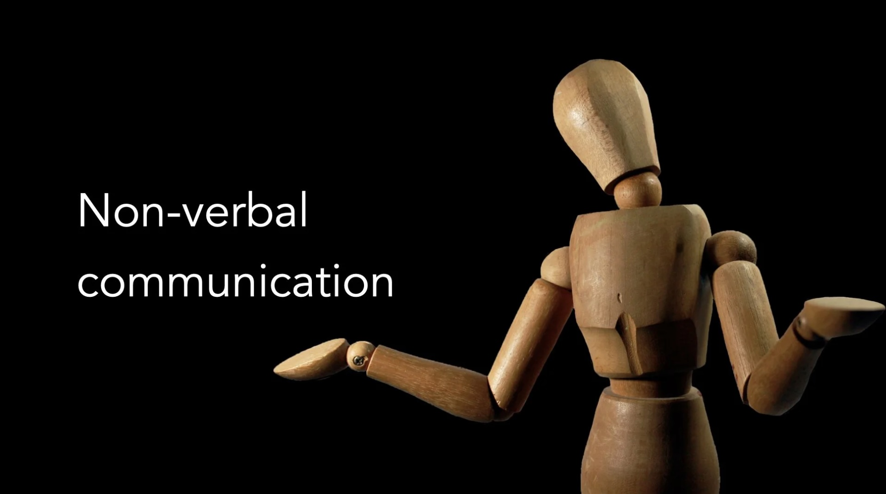

# Non-verbal Communication

*By Mark Sunner — Digital Ape Training*

---

Have you ever noticed how animated we become when trying to communicate across a language barrier? Without ever being told we instinctively realise that we can communicate a lot of information via facial expressions, hand gestures and vocal tones, especially if that's the only option available. The collective term for all the various forms of gesturing is 'Non-verbal communication'.

Gauging the importance of NVC is actually quite controversial. Surprisingly, a lot of the information available about this topic (allegedly couched in science) is wildly inaccurate — in this blog post, I will attempt to cut through all the WooWoo and focus on what you should know and what really works.

Non-verbal communication is an essential part of how we interact with others and can have a major impact on the success of our interactions. While it's important to understand and control our own non-verbal cues, it's also crucial to be aware of how others are communicating through their body language and other non-verbal cues. This allows us to better understand and connect with others, as well as to adjust our own communication style to better suit the situation and the person we are interacting with.

---

## The Mehrabian Myth

One myth that is often cited when discussing non-verbal communication is the Mehrabian myth. This myth suggests that the words we use only make up 7% of the impact of our communication, while the tone of our voice accounts for 38% and our body language accounts for 55%. However, this myth has been debunked by research and is not supported by evidence. In reality, the words we use, the tone of our voice, and our body language all play important roles in how we communicate and are all influenced by the context and the specific message we are trying to convey.

---

## Body Language Control

To effectively communicate through non-verbal cues, it's important to learn the best body language control. This involves understanding the various non-verbal cues that we can use, such as eye contact, facial expressions, gestures, and posture, and being able to use them effectively to convey our message. It's also important to be aware of how our body language may be perceived by others and to adjust it accordingly.

Another key aspect of non-verbal communication is ensuring that our body language matches our message. If our body language is inconsistent with what we are saying, it can create confusion and mistrust. For example, if we are saying one thing but our body language is indicating something else, such as crossed arms and a tense posture while saying we are open to an idea, it can be difficult for others to take us seriously.

People are also very good at picking up on subtle signs of discomfort or insincerity. If we are not genuine in our communication or are feeling uncomfortable, it can be difficult to hide this through non-verbal cues. Others may sense that something is off and may be less likely to trust or believe what we are saying.

---

## Three Tips to Elevate Your Non-verbal Communication

**1. Pay attention to your body language**

Make sure that your body language is consistent with your message and is not undermining what you are saying. This includes maintaining good eye contact, using appropriate facial expressions and gestures, and maintaining an open and confident posture.

**2. Be genuine and authentic**

People can sense when you are being insincere or uncomfortable, so it is important to be genuine and authentic in your communication. This will help to build trust and credibility with your audience.

**3. Be aware of your audience**

Pay attention to the nonverbal cues of your audience to better understand how they are receiving your message and adjust your style accordingly. This can help to create a better connection with your audience and make your message more effective.

---

## Summary

Effective nonverbal communication requires an understanding of our own nonverbal cues and the ability to control and modulate them, as well as an awareness of how others are communicating through their body language and other nonverbal cues. By learning to control our body language and ensuring that it is consistent with our message, we can better connect with others and communicate more effectively.
