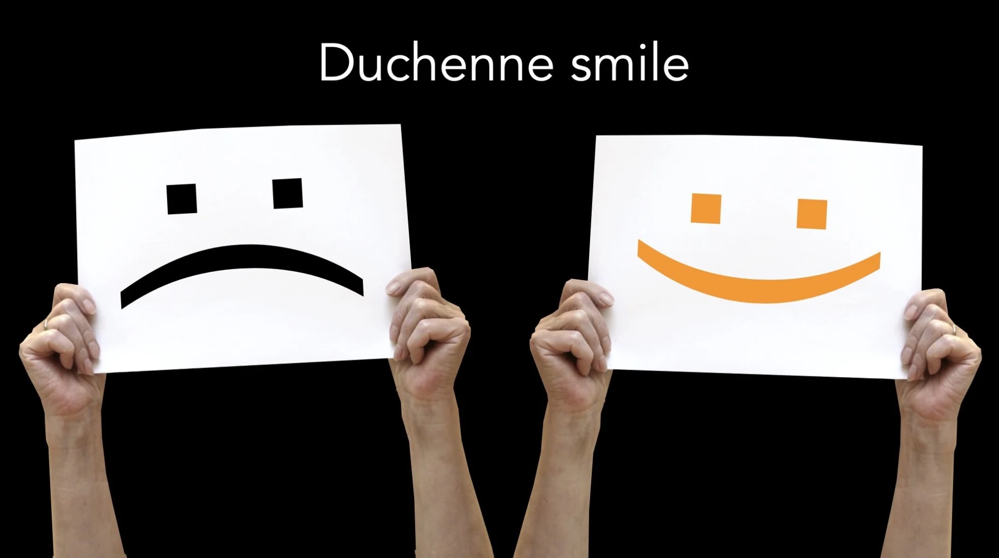

# What's in a Smile?

*By Mark Sunner — Digital Ape Training*

---

How can you tell if a smile is genuine or fake? When it's 'Duchenne'.

It turns out, our limbic brain is really good at spotting the difference between a fake 'put on' smile, from the genuine article. And this matters. As social creatures, we depend on others for our survival and happiness — as such, one of the most vital characteristics we quickly seek to determine when meeting someone new is 'trust'. Can we trust this person? A nice heartfelt genuine smile ticks this box with aplomb — whereas a fake or forced smile can trigger alarm bells.

So what is the difference? Turns out there are a number of different smile classifications. But we are concerned with just two: **Regular** or **Duchenne**.

---

## The Regular Smile

A regular smile employs the zygomatic major muscle which bends the mouth corners upwards — this is the smile we are all familiar with and photographers are fond of generating by getting their subjects to say "Cheese". But, a regular smile is not enough to signal the reaction is genuine — try looking back through your photo album for some uncomfortable proof.

---

## The Duchenne Smile

The Duchenne smile however, is the real deal! It's named after the French anatomist Guillaume Duchenne, who (about the same time Charles Darwin was writing *'On the Origin of Species'* in 1859) studied many different expressions of emotion. You probably don't want to know how he went about some of this 'research' — suffice to say he'd have a hard time finding willing volunteers for his electric probe parties today! But, some of his research bore real academic fruit. Duchenne identified that there are certain facial movements specific to a smile of 'genuine delight', and that this smile was different from all other types.

A Duchenne smile differs in that it also happens **above the nose**. Specifically, there is visible skin pinching under the eyes, crows feet to the side of each eye, all whilst the eyebrows remain flat. This particular combination of muscle movements is interpreted as a genuine emotional reaction. This is also why you may have detected someone was smiling even when wearing a face mask during the pandemic. Conversely, no discernible eye creasing means the smile is most likely fabricated — and even if you don't consciously register this, your unconscious limbic brain will, and will judge the situation accordingly.

The traditional view is that this muscle combination is not within voluntary control. But in fact, a Duchenne smile can indeed be faked — but it does take a little practice.

---

## The Oxytocin Connection

Technically, the recipient of a Duchenne smile receives a tiny hit of the neurochemical oxytocin, signalling the key "it's safe to approach" signal in the brain. Oxytocin is produced when we are trusted or shown a kindness, and it motivates cooperation with others. It does this by enhancing the sense of empathy, our ability to experience others' emotions. Empathy is very important for social creatures because it allows us to understand how others are likely to react in any given situation. This is especially important when meeting somebody for the first time.

---

## Conclusion

A Duchenne smile is a genuine expression of delight that involves specific facial movements and is difficult but not impossible to fake. Empathy and the production of oxytocin can enhance social connections, but our brains are good at detecting fake smiles — so it is important to be as authentic as possible to build trust and establish strong relationships.
