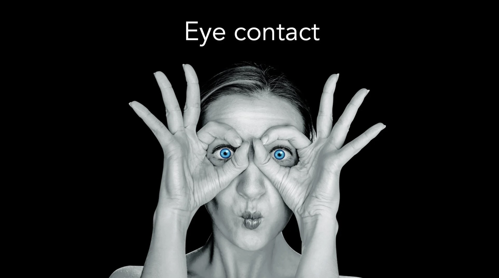

# Eye Contact: What's Actually Happening?

*By Mark Sunner — Digital Ape Training*

---

No discussion on presentation skills would be complete without mentioning eye contact.

Effective communicators have long espoused that maintaining eye contact is important when making a positive impact. And now, thanks to advances in eye tracking technology we can verify this is actually true. In studies, people make eye contact for approximately 30-60% during a typical conversation. However, this percentage rockets to **60-70%+** for professional communicators such as sales people or presenters. But why? What is the significance of making good eye contact, and how should this apply when delivering a speech or presentation?

---

## The Evolution of Human Eyes

Our eyes have evolved to be highly visible to other humans. Of all the other 220 species of primates, we alone have evolved a large white backdrop to our cornea, the outer ring surrounding your pupil. Evolutionary theory tells us that, in general, the only individuals who are around today are those whose ancestors did things that were beneficial to their own survival and reproduction. Therefore, if I have eyes that are easy to follow, it must be of some advantage to me.

Anthropologists speculate that homosapien eyes evolved this trait as a pre-language form of communication, and on a subliminal level it remains an impactful method of telegraphing intention.

---

## Saccadic Vision

In addition, your point of focus is actually incredibly narrow — roughly the size of your thumbnail when your arm is fully outstretched. That tiny section is all you can see in high definition and full colour all at once. But you remain unaware of this limitation because of the speed with which your eyes move to update the image as a whole (known as saccadic vision).

Where you are looking at any point in time telegraphs precisely where and what your attention is focused on — whether you want it to or not. Professional poker players are often so worried about eye-based information leakage, that many choose to wear sunglasses to prevent other players from interpreting these telltale cues!

---

## Four Eye Contact Techniques for Presenters

**1. Individual connection**

Practice maintaining eye contact with individual audience members for a few seconds at a time, rather than constantly shifting your gaze around the room. This will help you appear approachable and trustworthy.

**2. Hold for a thought**

Make an effort to pick out an audience member and hold eye contact with them for the duration of a thought. Doing so not only solidifies your connection with your audience but also slows down your speech, making you sound more authoritative and authentic. Keeping your eye contact steady for three to five seconds will allow you to concentrate better on your message.

**3. Emphasise key points**

Use eye contact to emphasise key points in your presentation. When you make a particularly important point, make sure to maintain eye contact with your audience for a few extra seconds to drive the point home.

**4. Distribute evenly**

Avoid staring at one person for an extended period of time, as this can make them feel uncomfortable. Instead, try to distribute your eye contact evenly around the room.

---

## Summary

When it comes to presenting, generous eye contact from a presenter fulfils two vital criteria for compelling engagement:

**First**, direct eye contact signals both trust and approachability. The audience will gauge your commitment by how your attention is distributed around the room — just as its absence signals disinterest.

**Second**, sustained eye contact signals dominance, which is important for leadership. This is especially important if you need to impose your will over a group — just be careful not to overplay sustained eye contact, or else it may be perceived as a threat.

With a little practice, you will soon find the right balance and master the art of effective eye contact and deliver more compelling presentations.
