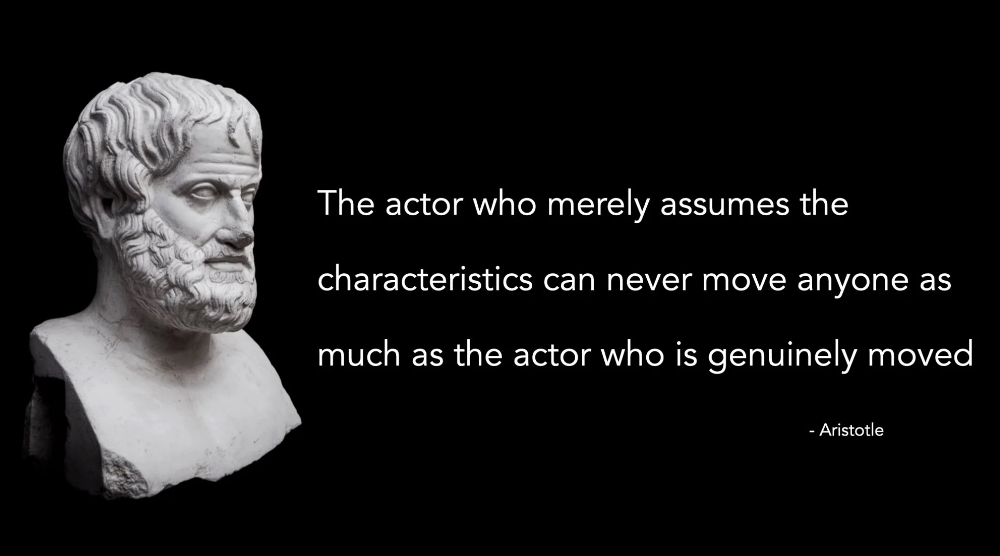

# Treading the Boards

*By Mark Sunner — Digital Ape Training*

---

Have you ever wished you could captivate an audience like a pro actor? Well, it turns out that acting techniques like method acting can actually be studied by public speakers to make their delivery more impactful and professional.

For those unfamiliar with method acting, it's a technique that emphasises the use of personal experiences and emotions to bring authenticity and depth to a performance. One of the key principles of method acting is the idea that an actor should strive to fully understand and embody the thoughts, feelings, and motivations of their character. By using their own emotions and personal experiences to connect with their character, actors can create a more authentic and believable performance.

---

## Aristotle on Authenticity

So how can public speakers apply these same principles to their own presentations? By understanding the emotions and perspectives of their audience, speakers can craft their message to resonate with their listeners. And, as Aristotle puts it:

> *"The actor who merely assumes the characteristics can never move anyone as much as the actor who is genuinely moved."*

In other words, a speaker who is genuinely moved by their own words and message is far more likely to deliver a powerful and authentic performance.

But here's the thing: acting techniques shouldn't be used to simply "fake" emotions or manipulate the audience. Instead, they should be used as a way to connect with and authentically convey the speaker's message.

---

## Three Acting Techniques for Presenters

**1. Develop a character**

Create a character that represents your message and goals for your presentation. By developing a character — a version of you that's obsessively on point — you can better understand the emotions and motivations behind your message, which can help you deliver a more authentic and compelling performance.

**2. Practice improvisation**

Improvisation involves reacting to unexpected situations or prompts in the moment. This can help you think on your feet and adapt to changing circumstances. It can also keep you present and engaged with your audience, improving the effectiveness of your delivery.

**3. Incorporate physical actions**

Use gestures, facial expressions, or movement to add another layer of meaning and emotion to your message. This can make it more powerful and engaging for your audience.

---

## Summary

If you're looking to take your delivery to the next level, why not consider trying out some acting techniques? Not only can this be a lot of fun, but by understanding and incorporating them, you can create a more impactful and polished performance that really lands with gravitas.

***Now go break a leg, daHling! ;-)***
