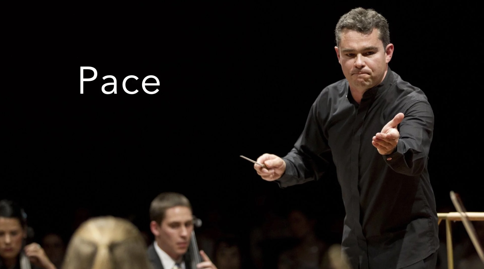

# Vocal Variety (Part 2): Pace

*By Mark Sunner — Digital Ape Training*

---

Have you ever noticed how the speed at which something is said can completely change its impact? This is something that the esteemed BBC, known for its top-notch presentation standards, understands very well. In fact, traditional BBC English is delivered at a rate of **150 words per minute**, or about 2.5 words per second. That's roughly 30 seconds for a 75-word segment, like the one we're using right now.

---

## When to Deviate

But here's the thing: there are definitely times when it's totally okay to deviate from this standard. For instance, if you're feeling pumped up and excited about something, you might naturally speak a little faster to convey that energy. On the other hand, if you want to give your words some extra emphasis or gravity, slowing things down can be a great way to do it.

---

## The Power of Pauses

And let's not forget about those precious pauses. Sometimes, a well-placed moment of silence can be just as powerful as words themselves, and remember, no one can actually process what you've said until you actually stop saying it. Liberal use of pauses gives your listeners a chance to absorb what you're saying whilst adding a sense of weight to your words. Just remember, it's all about finding that sweet spot between too fast and too slow.

---

## Finding Your Pace

But what if you're not sure what the right pace is for your message? That's where a little experimentation and practice come in. Think about the context in which you'll be speaking and your audience. What works in one situation might not be as effective in another.

So next time you're delivering a message, whether it's a presentation at work or just chatting with friends, take a moment to consider the speed at which you're speaking. It might just make **ALL** the difference in how your words are received.
