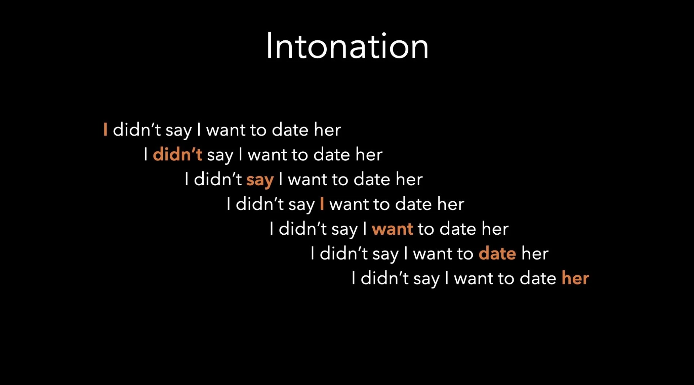

# Vocal Variety (Part 3): Intonation

*By Mark Sunner — Digital Ape Training*

---

What separates a good actor from a truly great actor when reading the same script? One answer is **nuance**. And a big part of a nuanced delivery is subtle control over intonation. What do we mean by this?

Well, the "no" you might say when someone is tickling you, is quite different to the ***"NO!"*** you might say if a child was about to step out in front of a bus. It's the same word, but conveys a very different meaning and a lot more information. All because you delivered it differently.

---

## The Power of Emphasis

That might be an extreme example. BUT, because of the way our brain processes intonation, even a subtle change can have the same magnitude of impact. Take this sentence for example:

> I didn't say I wanted to date her

The sentence on its own is purely factual, and if we deliver it in a monotone voice that is all people will hear. But, if we add a pinch of intonation, to stress any one of the individual words, it entirely changes the meaning of the sentence:

- ***I*** didn't say I wanted to date her *(someone else said it)*
- I didn't ***say*** I wanted to date her *(I implied it)*
- I didn't say I wanted to date ***her*** *(I want to date someone else)*

---

## Emotion Changes Everything

Intonation injects emotion, and that alters our interpretation. OK, so what? Why is it so important that we communicate with emotion?

Well, if you have been practicing out loud, but have not thought about where you are placing emphasis then you are missing out on a whole extra level of connection and engagement. Have you ever heard the expression "in one ear and out the other"? That tends to be what happens when we just hear facts. But, if you combine emotion with your delivery, it's a completely different story.

---

## Conclusion

Nuance and control over intonation can be key factors that separate a good speaker from a truly great speaker. Intonation is a powerful tool that can change the meaning and impact of a line or sentence by injecting emotion. By paying attention to intonation we can generate an even stronger connection with our audience and use it to encode a whole extra layer of information into our delivery.
