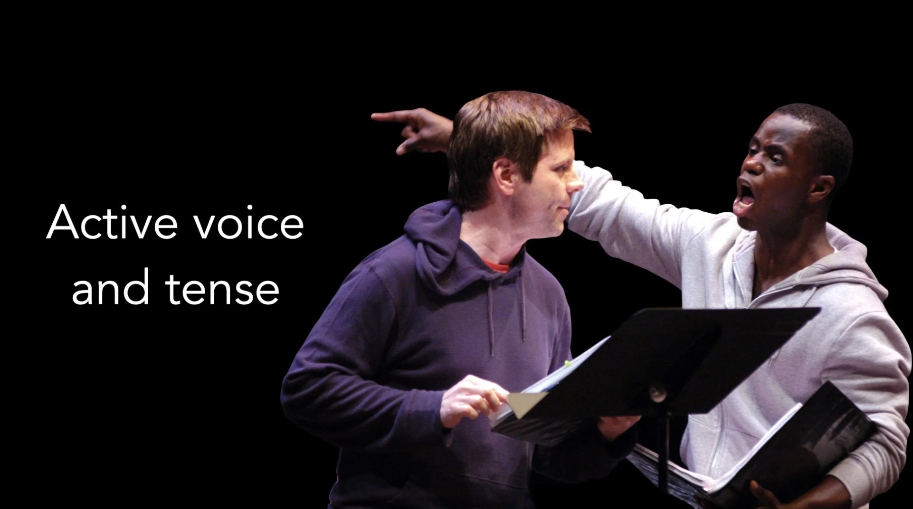

# Vocal Variety (Part 4): Active Voice and Tense

*By Mark Sunner — Digital Ape Training*

---

One aspect often overlooked when drafting a speech is the choice of verb tenses and voice used to craft the message. The use of present tense and active voice, as opposed to past tense and passive voice, can have a significant impact on how your message actually lands.

---

## The Power of Present Tense

Using present tense can help you to create a sense of immediacy and urgency. It means you are effectively bringing your message into the 'present moment', making it feel more relevant and important to your audience 'right now'. This is particularly useful when you want to create a sense of excitement or encourage a call to action. In contrast, using past tense can make the message feel distant, and therefore less relevant.

*Past tense TELLS — Present tense SHOWS*

---

## Active vs Passive Voice

Additionally, using active voice as opposed to passive voice can make a big difference in how your message is received. The active voice makes the message more dynamic, clear and direct. It makes it easier for your audience to follow along and understand the message. Essentially, when using passive voice, things happen **TO** you — but when using active voice you **MAKE** things happen.

*Passive voice is distant — Active voice is direct*

---

## Four Tips for Better Voice and Tense

**1. Use present tense to focus on the present and future**

When crafting your message, focus on the present and future implications of your topic. Use present tense to create a sense of immediacy and to encourage a call to action. This can help to make your message more relevant and impactful.

**2. Keep it simple**

Be direct. Active voice makes it easier for your audience to understand the message, and can make it more dynamic and engaging.

**3. Use real-world examples and anecdotes**

Be sure to relate to your audience's experiences and interests. This will make your message more relatable, and help to drive your point home. Additionally, examples help to make the message feel more present, and less abstract, making it more memorable for the audience.

**4. Practice your delivery and style**

Rehearsing your delivery and style, practicing the use of present tense, active voice, and adding real-world examples, is important as it gives you the opportunity to check how you are communicating the message and have time to adjust it if needed before delivering it.

---

## Conclusion

Present tense and active voice can make your message far more engaging and therefore land with more resonance. It allows you to create a sense of immediacy, clarity and directness that can help to grab your audience's attention and keep them engaged throughout your speech or presentation. So the next time you're crafting a message, consider using present tense and active voice to make it more powerful and effective.
