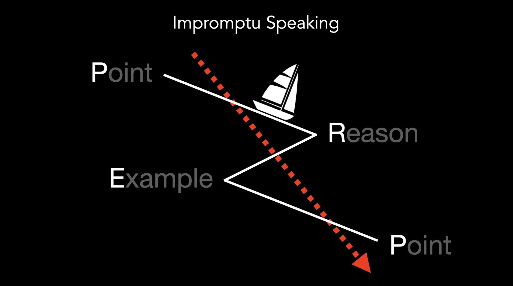

# Sailing Through Impromptu Speaking with PREP

*By Mark Sunner — Digital Ape Training*

---

Navigating through the sea, a sailboat does not move in a straight line from point A to B. Instead, it ***"Tacks"***, zig-zagging its way, working with and against the wind, finding a way forward towards the ultimate destination. Similarly, the art of impromptu speaking, especially in high-stakes situations, isn't about a direct and predictable path but rather about deftly manoeuvring through the points of conversation in a way that sounds compelling and engaging.

---

## The High-Stakes Scenario

Picture this: You're at a bustling trade show, manning your company's booth. Suddenly, a journalist with a camera crew in tow approaches you, microphone outstretched, asking pointed questions about your company and its offerings. Alternatively, imagine you're live on a radio show, discussing your latest business venture, when suddenly, the conversation veers into unfamiliar territory. In both these high-stakes situations, you need to provide a response that's both immediate and polished, a response that reflects well on you and your company.

Metaphorically speaking, the PREP (**P**oint, **R**eason, **E**xample, **P**oint) framework can be likened to the zig-zag technique of sailing. It ensures we reach our destination effectively, without being blown off course, even if the path isn't a straight line.

---

## The Point: Anchor in the Storm

In the tempest of unexpected questions, your initial point is your anchor. It establishes your stance, providing a foundation for the rest of your response. Be concise and clear. In the sea of corporate chatter, this initial clarity will guide your audience through your ensuing narrative.

## The Reason: Your North Star

The reason gives direction to your point. It's the 'why' behind your stance, giving your audience a clear trajectory to follow. In the fast-paced dialogue of a trade show or live interview, this step provides context and depth, showing your thought process.

## The Example: The Wind in Your Sails

This is the powerhouse of your narrative. Just as the wind fills the sails and propels the boat, your example should animate your argument, giving it momentum and carrying it forward. It's about painting a vivid picture with words. Can you immerse your listeners in the story? By being as visceral as possible with your descriptive language, you dramatically dial-up the level of impact. In the long run, people may forget the exact details of what you said, but they will never forget how you made them feel. Provide evocative details to give them a sense of the atmosphere, the feelings it evoked, and the moments that gave you goosebumps.

## Revisiting the Point: Safe Harbour

As you conclude your impromptu narrative, return to your initial point. This final step provides closure and re-emphasises your stance, bringing your audience back to the safety of the harbour. It reinforces your initial declaration, leaving a strong, lasting impression.

---

## Conclusion

The PREP framework is a formidable tool in high-stakes, impromptu situations. By building your response piece by piece, from the initial point through the reason, brought to life by an evocative example, and rounding off with revisiting your point, you create a polished narrative that leaves an enduring impact. With the PREP structure as your guide, you'll find that navigating the stormy seas of unexpected questions becomes a manageable, even enjoyable, task.
